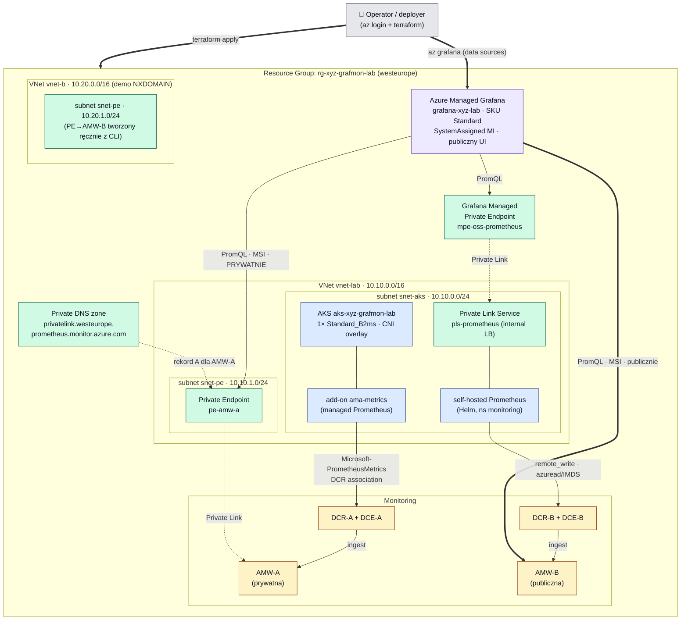

# 01 — Architektura

[◄ README](README.md) · [Przepływ metryk ►](02-metrics-flow.md)

## Idea

Wszystkie zasoby żyją w jednej grupie zasobów `rg-xyz-grafmon-lab`
([main.tf:4](../grafana-poc-example/terraform/main.tf#L4)), w regionie `westeurope`
([terraform.tfvars:7](../grafana-poc-example/terraform/terraform.tfvars#L7)). Dzięki temu
skasowanie jednej grupy sprząta całe laboratorium.

Centralnym elementem jest **Azure Monitor Workspace (AMW)** — zarządzany magazyn metryk
Prometheusa. Grafana nie łączy się z Prometheusem bezpośrednio; odpytuje **query endpoint
AMW** jako źródło danych typu `prometheus`. PoC świadomie stawia **dwa** AMW, żeby pokazać
dwie różne ścieżki *zbierania* metryk oraz dwa różne modele *prywatyzacji dostępu*.

| | **AMW‑A** | **AMW‑B** |
|---|---|---|
| Źródło metryk | Dodatek managed‑Prometheus w AKS (`ama-metrics`) | Self‑hosted Prometheus (Helm) |
| Transport ingest | Powiązanie DCR (AKS → DCR‑A) | `remote_write` HTTP → DCR‑B |
| Uwierzytelnianie ingest | MI klastra + MI kubeleta AKS | MI kubeleta (IMDS), blok `azuread` |
| Dostęp z Grafany | **Prywatny** — Private Endpoint + Private DNS | Publiczny query endpoint |
| Prywatna ścieżka do źródła | — | Grafana MPE → Private Link Service |
| Definicja | [monitoring.tf:18‑64](../grafana-poc-example/terraform/monitoring.tf#L18-L64) | [monitoring.tf:69‑113](../grafana-poc-example/terraform/monitoring.tf#L69-L113) |

## Diagram architektury (całość)

> Linia `-.->` = ścieżka prywatna (Private Link). Linia `==>` = publiczna. `-->` = w obrębie
> sieci / logiczne powiązanie.

## Inwentarz zasobów

| Zasób Azure | Nazwa | Plik | Rola w PoC |
|---|---|---|---|
| Resource Group | `rg-xyz-grafmon-lab` | [main.tf](../grafana-poc-example/terraform/main.tf) | Kontener całości |
| AKS | `aks-xyz-grafmon-lab` | [aks.tf:9](../grafana-poc-example/terraform/aks.tf#L9) | Host `ama-metrics` i self‑hosted Prometheusa |
| Monitor Workspace | `amw-a` | [monitoring.tf:18](../grafana-poc-example/terraform/monitoring.tf#L18) | Backend Prometheusa (managed, prywatny) |
| Monitor Workspace | `amw-b` | [monitoring.tf:69](../grafana-poc-example/terraform/monitoring.tf#L69) | Backend Prometheusa (self‑hosted, publiczny) |
| DCE | `dce-amw-a` / `dce-amw-b` | [monitoring.tf:25](../grafana-poc-example/terraform/monitoring.tf#L25),[76](../grafana-poc-example/terraform/monitoring.tf#L76) | Punkt wejścia danych |
| DCR | `dcr-amw-a` / `dcr-amw-b` | [monitoring.tf:38](../grafana-poc-example/terraform/monitoring.tf#L38),[87](../grafana-poc-example/terraform/monitoring.tf#L87) | Reguła routingu strumienia do AMW |
| Managed Grafana | `grafana-xyz-lab` | [grafana.tf:9](../grafana-poc-example/terraform/grafana.tf#L9) | Warstwa wizualizacji / zapytań |
| VNet | `vnet-lab` (10.10.0.0/16) | [network.tf:13](../grafana-poc-example/terraform/network.tf#L13) | Sieć główna (AKS + PE) |
| VNet | `vnet-b` (10.20.0.0/16) | [network.tf:41](../grafana-poc-example/terraform/network.tf#L41) | Poletko pod demo NXDOMAIN |
| Private Endpoint | `pe-amw-a` | [dns.tf:36](../grafana-poc-example/terraform/dns.tf#L36) | Prywatny dostęp do AMW‑A |
| Private DNS zone | `privatelink.westeurope.prometheus.monitor.azure.com` | [dns.tf:16](../grafana-poc-example/terraform/dns.tf#L16) | Rozwiązanie prywatnego rekordu AMW‑A |
| Private Link Service | `pls-prometheus` | [prometheus-values.yaml:41](../grafana-poc-example/terraform/k8s/prometheus-values.yaml#L41) | Publikacja self‑hosted Prometheusa (tworzy AKS) |
| Grafana MPE | `mpe-oss-prometheus` | [configure-grafana.sh:47](../grafana-poc-example/terraform/configure-grafana.sh#L47) | Prywatny wjazd Grafany do PLS |

## Providery i wersje

Logowanie „z otoczenia" (`az login`), bez sekretów w kodzie
([providers.tf](../grafana-poc-example/terraform/providers.tf)).

| Provider | Ograniczenie wersji | Zablokowana w lock | 
|---|---|---|
| `hashicorp/azurerm` | `~> 4.0` | `4.81.0` |
| `hashicorp/azuread` | `~> 2.50` | `2.53.1` |
| Terraform | `>= 1.5` | — |

Źródło: [providers.tf:6‑19](../grafana-poc-example/terraform/providers.tf#L6-L19),
`.terraform.lock.hcl`.
