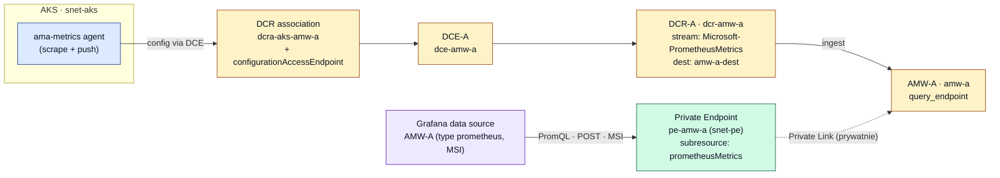
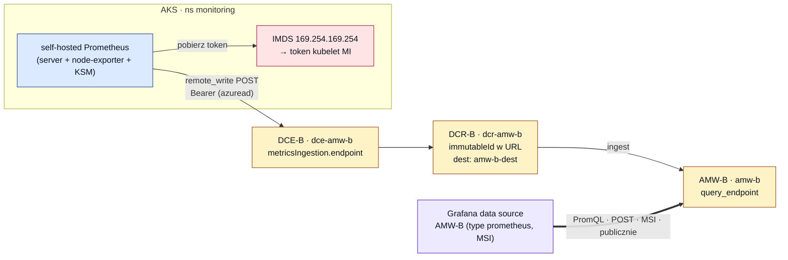
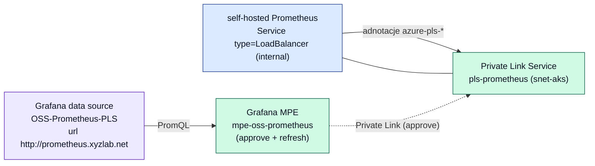

# 02 — Przepływ metryk (end‑to‑end)

[◄ Architektura](01-architecture.md) · [Sieć i DNS ►](03-networking-dns.md)

Każda ścieżka ma dwa odcinki: **ingest** (Prometheus → AMW) i **query** (Grafana → AMW).
Ingest w Azure zawsze idzie przez parę **DCE** (Data Collection Endpoint — punkt wejścia)
i **DCR** (Data Collection Rule — reguła „skąd strumień i dokąd go zapisać"),
[monitoring.tf:11‑13](../grafana-poc-example/terraform/monitoring.tf#L11-L13).

## Ścieżka A — managed Prometheus (AMW‑A, prywatna)

Dodatek `monitor_metrics {}` w AKS ([aks.tf:46](../grafana-poc-example/terraform/aks.tf#L46))
uruchamia agenta `ama-metrics`, który sam skrobie metryki i wysyła strumień
`Microsoft-PrometheusMetrics`. Powiązania DCR ([aks.tf:56‑68](../grafana-poc-example/terraform/aks.tf#L56-L68))
kierują ten strumień do DCR‑A, a ten zapisuje do AMW‑A. Grafana odpytuje AMW‑A **prywatnie**
przez Private Endpoint.



**Uwierzytelnianie ingest:** rolę `Monitoring Metrics Publisher` na DCR‑A nadano **obu**
tożsamościom AKS (control‑plane MI i kubelet MI), bo nie było pewne, której używa
`ama-metrics` — nadmiarowo, ale bezpiecznie
([rbac.tf:52‑62](../grafana-poc-example/terraform/rbac.tf#L52-L62)).

## Ścieżka B — self‑hosted Prometheus (AMW‑B, publiczna)

Prometheus z chartu `prometheus-community/prometheus` (namespace `monitoring`) wysyła
metryki przez `remote_write` na endpoint DCE‑B/DCR‑B. Uwierzytelnia się blokiem `azuread`
z `client_id` **tożsamości kubeleta**, pobieranej z IMDS (`169.254.169.254`) na węźle
([prometheus-values.yaml:20‑29](../grafana-poc-example/terraform/k8s/prometheus-values.yaml#L20-L29)).
Grafana odpytuje AMW‑B **publicznie** przez jej query endpoint.



**Budowa URL `remote_write`** ([deploy-k8s.sh:67](../grafana-poc-example/terraform/k8s/deploy-k8s.sh#L67)):

```
{DCE-B metricsIngestion.endpoint}/dataCollectionRules/{DCR-B immutableId}
    /streams/Microsoft-PrometheusMetrics/api/v1/write?api-version=2023-04-24
```

`deploy-k8s.sh` czyta te wartości z `terraform output` i wstrzykuje (sed) w miejsce
placeholderów w [prometheus-values.yaml](../grafana-poc-example/terraform/k8s/prometheus-values.yaml).
Skrypt twardo waliduje, że żadna nie jest pusta — pusta wartość skleiłaby wadliwy URL i AMW‑B
nigdy nie przyjęłaby metryk ([deploy-k8s.sh:59‑65](../grafana-poc-example/terraform/k8s/deploy-k8s.sh#L59-L65)).

## Ścieżka B' — prywatny dostęp do self‑hosted Prometheusa (S1.6)

Niezależnie od `remote_write` (który dostarcza metryki do AMW‑B), Grafana może też
odpytywać **bezpośrednio** self‑hosted Prometheusa — prywatnie. Prometheus jest wystawiony
przez wewnętrzny LoadBalancer, który adnotacjami tworzy **Private Link Service**
`pls-prometheus`. Grafana łączy się z nim przez **Managed Private Endpoint**.



Szczegóły sieciowe (dlaczego wymaga wyłączenia `private_link_service_network_policies` i
roli Network Contributor) — patrz [03 — Sieć i DNS](03-networking-dns.md).

## Cztery źródła danych w Grafanie

Tworzone skryptem `az grafana` po `apply`
([configure-grafana.sh](../grafana-poc-example/terraform/configure-grafana.sh)):

| Źródło | Typ | URL | Auth | Ścieżka |
|---|---|---|---|---|
| `AMW-A` | `prometheus` | `amw_a_query_endpoint` | MSI | prywatna (PE) |
| `AMW-B` | `prometheus` | `amw_b_query_endpoint` | MSI | publiczna |
| `AzMon-CurrentUser` | `grafana-azure-monitor-datasource` | — | currentuser | publiczna |
| `OSS-Prometheus-PLS` | `prometheus` | `http://prometheus.xyzlab.net` | brak | prywatna (MPE→PLS) |

> Dlaczego to skrypt, a nie Terraform — patrz [07 — Decyzje projektowe](07-design-decisions.md#dlaczego-data-source-tworzy-skrypt-a-nie-terraform).
