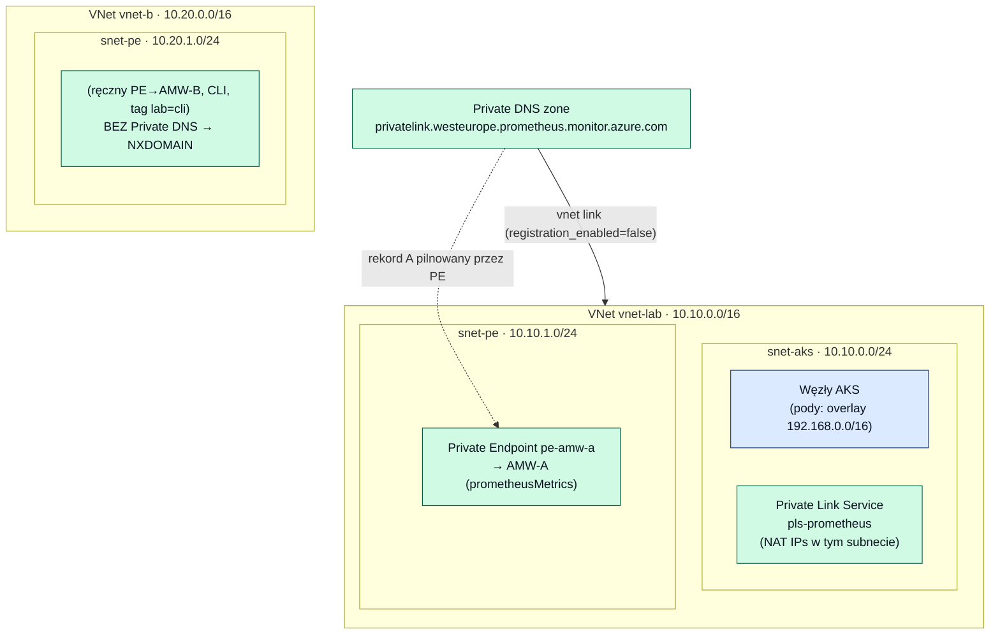
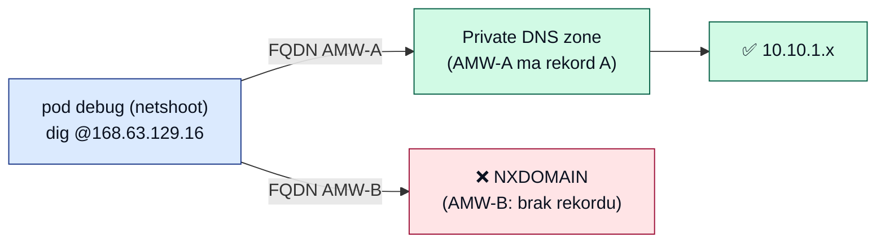

# 03 — Sieć i DNS

[◄ Przepływ metryk](02-metrics-flow.md) · [RBAC i tożsamości ►](04-rbac-identity.md)

## Topologia sieci

Dwie osobne sieci wirtualne ([network.tf](../grafana-poc-example/terraform/network.tf)):

| VNet | CIDR | Subnety | Przeznaczenie |
|---|---|---|---|
| `vnet-lab` | `10.10.0.0/16` | `snet-aks` (10.10.0.0/24), `snet-pe` (10.10.1.0/24) | Sieć główna: węzły AKS, PLS, Private Endpoint do AMW‑A |
| `vnet-b` | `10.20.0.0/16` | `snet-pe` (10.20.1.0/24) | Poletko pod PE→AMW‑B tworzony ręcznie z CLI (demo NXDOMAIN) |

Sieć AKS działa na **Azure CNI w trybie overlay** — Pody dostają adresy z osobnej puli
`192.168.0.0/16` (`pod_cidr`), niezależnej od adresacji VNetu; `service_cidr` = `10.240.0.0/16`
([aks.tf:35‑42](../grafana-poc-example/terraform/aks.tf#L35-L42)).

## Prywatna ścieżka do AMW‑A (Private Endpoint + Private DNS)

Trzy elementy ([dns.tf](../grafana-poc-example/terraform/dns.tf)):

1. **Jawna Private DNS zone** `privatelink.westeurope.prometheus.monitor.azure.com`
   ([dns.tf:16](../grafana-poc-example/terraform/dns.tf#L16)) — deklarowana wprost (a nie
   auto‑tworzona przez PE), żeby `terraform destroy` sprzątał bez osieroconych rekordów.
2. **VNet link** strefy do `vnet-lab` ([dns.tf:23](../grafana-poc-example/terraform/dns.tf#L23))
   z `registration_enabled = false` — pody w AKS rozwiązują prywatny rekord A do AMW‑A.
3. **Private Endpoint `pe-amw-a`** w `snet-pe` z `private_dns_zone_group`
   ([dns.tf:36‑55](../grafana-poc-example/terraform/dns.tf#L36-L55)) — Azure sam utrzymuje
   rekord A dla AMW‑A (subresource `prometheusMetrics`).

**Interfejs Grafany zostaje publiczny** (`public_network_access_enabled = true`,
[grafana.tf:16](../grafana-poc-example/terraform/grafana.tf#L16)). Prywatyzowane są **dane i
źródła**, nie sam UI. Wymaga to SKU **Standard** (Managed Private Endpoints,
[grafana.tf:13](../grafana-poc-example/terraform/grafana.tf#L13)).

## Prywatna ścieżka do self‑hosted Prometheusa (PLS, S1.6)

Self‑hosted Prometheus jest wystawiony przez **wewnętrzny LoadBalancer**, którego adnotacje
każą AKS utworzyć **Private Link Service** `pls-prometheus` w node RG
([prometheus-values.yaml:36‑45](../grafana-poc-example/terraform/k8s/prometheus-values.yaml#L36-L45)).
Dwa warunki po stronie Terraform:

- `snet-aks` ma `private_link_service_network_policies_enabled = false`
  ([network.tf:28](../grafana-poc-example/terraform/network.tf#L28)) — inaczej PLS nie umieści
  tu swoich adresów NAT.
- Tożsamość klastra AKS ma `Network Contributor` na `vnet-lab`
  ([rbac.tf:77‑81](../grafana-poc-example/terraform/rbac.tf#L77-L81)) — inaczej internal LB
  zostaje `<pending>` z 403 na odczyt subnetu.

Grafana łączy się z PLS przez **Managed Private Endpoint** `mpe-oss-prometheus`, po czym
połączenie się zatwierdza i odświeża ([configure-grafana.sh:44‑53](../grafana-poc-example/terraform/configure-grafana.sh#L44-L53)).

## Demo NXDOMAIN (S1.3) — dlaczego AMW‑B nie ma PE

To celowe. PoC **nie** tworzy Private Endpointu do AMW‑B w Terraformie
([dns.tf:34‑35](../grafana-poc-example/terraform/dns.tf#L34-L35)). Ręczny PE→AMW‑B stawiany z
CLI (w `vnet-b`, tag `lab=cli`) **bez** grupy stref DNS pokazuje rozjeżdżający się DNS:
FQDN privatelink nie ma rekordu → NXDOMAIN.

| Cel `dig` (z poda debug, `@168.63.129.16`) | Oczekiwany wynik |
|---|---|
| FQDN AMW‑A (privatelink) | Rekord A z `10.10.1.0/24` (subnet `snet-pe`) — działa |
| FQDN AMW‑B, brak PE / brak strefy | **NXDOMAIN** |
| FQDN AMW‑B, ręczny PE **bez** DNS zone group | **NXDOMAIN** (mimo istniejącego PE) |
| FQDN AMW‑B, PE **z** poprawnym DNS | Rekord A — działa |

Sondy DNS wykonuje pod diagnostyczny `debug` na obrazie `nicolaka/netshoot` (dig, nslookup,
curl), [debug-pod.yaml](../grafana-poc-example/terraform/k8s/debug-pod.yaml).

