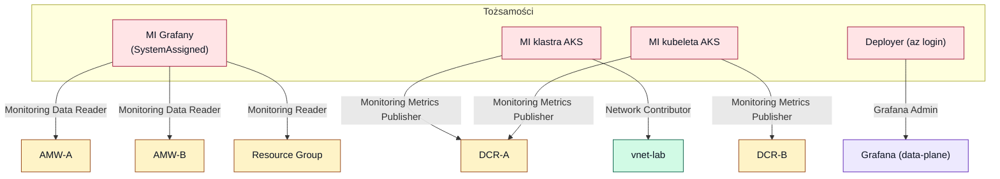

# 04 — RBAC i tożsamości

[◄ Sieć i DNS](03-networking-dns.md) · [Runbook wdrożenia ►](05-deployment-runbook.md)

## Model tożsamości

W PoC nie ma żadnych sekretów w kodzie — wszystko opiera się na tożsamościach
zarządzanych (MI) i sesji `az login`
([providers.tf:28‑30](../grafana-poc-example/terraform/providers.tf#L28-L30)):

| Tożsamość | Typ | Skąd | Do czego |
|---|---|---|---|
| MI Grafany | SystemAssigned | [grafana.tf:18‑20](../grafana-poc-example/terraform/grafana.tf#L18-L20) | Odczyt metryk z AMW‑A/B (data source, auth `msi`) |
| MI klastra AKS | SystemAssigned | [aks.tf:31‑33](../grafana-poc-example/terraform/aks.tf#L31-L33) | Zapis metryk (DCR‑A), operacje sieciowe (PLS) |
| MI kubeleta AKS | (auto z klastra) | `kubelet_identity` | Zapis metryk z DCR‑A i DCR‑B; token dla `remote_write` przez IMDS |
| Deployer (bieżący user) | Azure AD | [identity.tf:15](../grafana-poc-example/terraform/identity.tf#L15) | Grafana Admin (tworzenie źródeł danych) |

> **Usunięty service principal (S2.3):** wcześniej `identity.tf` tworzył app registration +
> SP + sekret jako „service credential" dla Azure Monitor w Grafanie. Usunięto, bo środowisko
> nie ma uprawnień do rejestracji aplikacji — `apply` by się wywalił
> ([identity.tf:3‑12](../grafana-poc-example/terraform/identity.tf#L3-L12)). Skutek: brak
> fallbacku SP w źródle `AzMon-CurrentUser`, S2.3 nie jest dziś demonstrowalny.

## Diagram: kto się do czego uwierzytelnia

## Macierz RBAC

Wszystkie nadania w [rbac.tf](../grafana-poc-example/terraform/rbac.tf):

| Principal | Rola | Scope | Po co | Kod |
|---|---|---|---|---|
| MI Grafany | `Monitoring Data Reader` | AMW‑A | Odczyt metryk (data source AMW‑A) | [15‑19](../grafana-poc-example/terraform/rbac.tf#L15-L19) |
| MI Grafany | `Monitoring Data Reader` | AMW‑B | Odczyt metryk (data source AMW‑B) | [21‑25](../grafana-poc-example/terraform/rbac.tf#L21-L25) |
| MI Grafany | `Monitoring Reader` | RG | Źródło Azure Monitor — enumeracja zasobów | [30‑34](../grafana-poc-example/terraform/rbac.tf#L30-L34) |
| MI klastra AKS | `Monitoring Metrics Publisher` | DCR‑A | Zapis metryk z `ama-metrics` | [52‑56](../grafana-poc-example/terraform/rbac.tf#L52-L56) |
| MI kubeleta AKS | `Monitoring Metrics Publisher` | DCR‑A | Zapis metryk (nadmiarowo, „którakolwiek") | [58‑62](../grafana-poc-example/terraform/rbac.tf#L58-L62) |
| MI kubeleta AKS | `Monitoring Metrics Publisher` | DCR‑B | `remote_write` self‑hosted Prometheusa (IMDS) | [67‑71](../grafana-poc-example/terraform/rbac.tf#L67-L71) |
| MI klastra AKS | `Network Contributor` | `vnet-lab` | Internal LB + PLS w BYO subnet | [77‑81](../grafana-poc-example/terraform/rbac.tf#L77-L81) |
| Deployer | `Grafana Admin` | Grafana | Tworzenie/zarządzanie źródłami danych | [86‑90](../grafana-poc-example/terraform/rbac.tf#L86-L90) |
| Configurator (opc.) | `Grafana Admin` | Grafana | Gdy skrypt odpala inne konto niż `apply` | [98‑103](../grafana-poc-example/terraform/rbac.tf#L98-L103) |
| Test user (opc.) | `Grafana Viewer` | Grafana | Logowanie do Grafany w ogóle | [109‑114](../grafana-poc-example/terraform/rbac.tf#L109-L114) |
| Test user (opc.) | `Monitoring Reader` | RG | Scenariusze Obszaru 2 | [116‑121](../grafana-poc-example/terraform/rbac.tf#L116-L121) |

## Trzy niuanse warte zapamiętania

1. **Podwójne nadanie na DCR‑A** — recenzenci nie zgadzali się, czy `ama-metrics` używa MI
   control‑plane czy kubeleta; nadano obu, „nieszkodliwie nadmiarowo", by ingest nie padł na
   403 od złego principala ([rbac.tf:44‑51](../grafana-poc-example/terraform/rbac.tf#L44-L51)).
2. **`kubelet client_id` w `remote_write` nie może być pusty** — pusty wybrałby
   system‑assigned MI, którego węzły nie mają; `deploy-k8s.sh` podstawia
   `aks_kubelet_client_id` ([prometheus-values.yaml:16‑18](../grafana-poc-example/terraform/k8s/prometheus-values.yaml#L16-L18)).
3. **Owner na subskrypcji ≠ dostęp do danych Grafany** — potrzebna jawna rola Grafana
   (Admin/Viewer). Stąd `configurator_object_id`, gdy skrypt odpala inne konto
   ([variables.tf:44‑54](../grafana-poc-example/terraform/variables.tf#L44-L54)).
