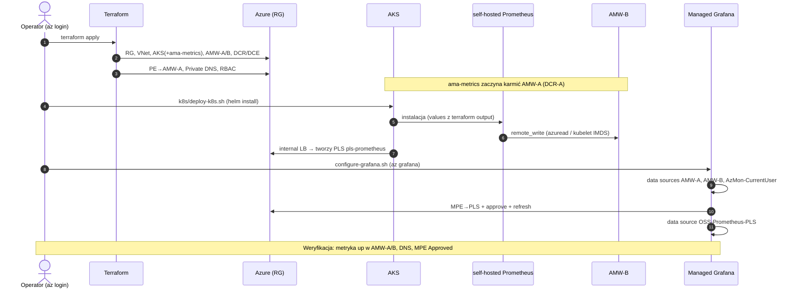

# 05 — Runbook wdrożenia

[◄ RBAC i tożsamości](04-rbac-identity.md) · [Scenariusze demo ►](06-scenarios.md)

## Kolejność (obowiązkowa)

```
1. terraform apply            # infrastruktura + RBAC + PE→AMW-A + Private DNS
2. k8s/deploy-k8s.sh          # self-hosted Prometheus (remote_write→AMW-B) + PLS + pod debug
3. configure-grafana.sh       # 4 źródła danych w Grafanie + MPE→PLS (S1.6)
```

Kolejność wynika z zależności: `configure-grafana.sh` czyta `terraform output` i szuka PLS
`pls-prometheus`, który powstaje dopiero w kroku 2 (z adnotacji usługi). Jeśli PLS jeszcze
nie ma, skrypt to wykrywa i prosi o uruchomienie `deploy-k8s.sh` najpierw
([configure-grafana.sh:54‑55](../grafana-poc-example/terraform/configure-grafana.sh#L54-L55)).

## Diagram sekwencji



## Krok 1 — `terraform apply`

Loguje się z sesji `az login`; subskrypcja z
[terraform.tfvars:6](../grafana-poc-example/terraform/terraform.tfvars#L6). Tworzy całą
infrastrukturę i RBAC. Dodatek `ama-metrics` startuje sam i od razu karmi AMW‑A.

## Krok 2 — `k8s/deploy-k8s.sh`

([deploy-k8s.sh](../grafana-poc-example/terraform/k8s/deploy-k8s.sh)) Wymaga: `kubectl`,
`helm >= 3`, `jq`, zalogowany `az`. Po kolei:

1. Czyta z `terraform output`: `dce_b_id`, `dcr_b_id`, `aks_kubelet_client_id`, składa URL `remote_write`.
2. Pobiera `metricsIngestion.endpoint` (DCE‑B) i `immutableId` (DCR‑B) przez `az resource show` (API `2023-03-11`), waliduje że nie są puste.
3. `az aks get-credentials`, `helm upgrade --install prometheus` do ns `monitoring` z podstawionymi placeholderami.
4. `kubectl apply` poda diagnostycznego `debug`.

> Obsługuje Git Bash/MSYS (konwersja ścieżek `to_native`, `MSYS_NO_PATHCONV=1` dla ID zasobów Azure).

**Weryfikacja:**
```bash
kubectl -n monitoring get pods
kubectl -n monitoring logs -l app=prometheus,component=server --tail=20
```

## Krok 3 — `configure-grafana.sh`

([configure-grafana.sh](../grafana-poc-example/terraform/configure-grafana.sh)) Idempotentny
(kasuje źródło o tej samej nazwie, potem tworzy). Tworzy `AMW-A`, `AMW-B`,
`AzMon-CurrentUser`, a jeśli istnieje PLS — stawia MPE, zatwierdza połączenie, odświeża i
dodaje `OSS-Prometheus-PLS`.

## Sprzątanie

```
teardown.sh <resource-group> <grafana-name>    # PRZED destroy, jeśli robiłeś kroki S1.x z CLI
terraform destroy
```

`teardown.sh` ([teardown.sh](../grafana-poc-example/terraform/teardown.sh)) kasuje zasoby
tworzone ręcznie (Grafana MPE, PE z tagiem `lab=cli`, grupy reguł Prometheus) i przywraca
publiczny dostęp do AMW — inaczej `destroy` blokuje się (np. PE trzymający subnet = 409).
Zasoby zarządzane Terraformem (PE→AMW‑A, strefa DNS) zostawia dla `destroy`.
