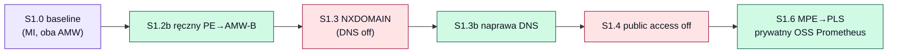

# 06 — Scenariusze demo

[◄ Runbook wdrożenia](05-deployment-runbook.md) · [Decyzje projektowe ►](07-design-decisions.md)

Scenariusze rekonstruowane z komentarzy w kodzie (pełny „test‑plan" nie znajduje się w tym
katalogu — patrz odniesienia do `test-plan.md` / `dns-probe.sh` w
[debug-pod.yaml:12](../grafana-poc-example/terraform/k8s/debug-pod.yaml#L12)). Poniższe opisy
są rekonstrukcją; oznaczone ⚠️ wymagają zewnętrznego planu testów.

## Obszar 1 — prywatna łączność (S1.x)

| ID | Co pokazuje | Jak | Oczekiwany wynik | Odniesienie |
|---|---|---|---|---|
| S1.0 | Baseline: oba AMW jako źródła w Grafanie (MI) | `configure-grafana.sh` + „Test" | Zapytania PromQL zwracają metryki z AMW‑A/B | [deploy-k8s.sh:108](../grafana-poc-example/terraform/k8s/deploy-k8s.sh#L108) |
| S1.2b | Ręczny PE→AMW‑B w `vnet-b` (CLI, tag `lab=cli`) | `az network private-endpoint ...` | PE istnieje, ale bez DNS zone group | [network.tf:38‑39](../grafana-poc-example/terraform/network.tf#L38-L39) |
| S1.3 | Rozjeżdżający się DNS → NXDOMAIN | `dig` z poda `debug` | AMW‑A ✅ rekord A; AMW‑B ❌ NXDOMAIN | [dns.tf:9‑11](../grafana-poc-example/terraform/dns.tf#L9-L11) |
| S1.3b ⚠️ | Poprawienie DNS dla PE→AMW‑B | Dodanie/naprawa strefy | AMW‑B zaczyna się rozwiązywać | [teardown.sh:23](../grafana-poc-example/terraform/teardown.sh#L23) |
| S1.4 ⚠️ | Wyłączenie publicznego dostępu AMW | `publicNetworkAccess=Disabled` | Publiczne zapytania padają; prywatne działają | [teardown.sh:43‑46](../grafana-poc-example/terraform/teardown.sh#L43-L46) |
| S1.5 ⚠️ | Kolejne MPE Grafany | `az grafana managed-private-endpoint` | — | [teardown.sh:23](../grafana-poc-example/terraform/teardown.sh#L23) |
| S1.6 | Grafana → self‑hosted Prometheus przez MPE→PLS | `configure-grafana.sh` sekcja S1.6 | `OSS-Prometheus-PLS` odpowiada prywatnie | [configure-grafana.sh:44‑53](../grafana-poc-example/terraform/configure-grafana.sh#L44-L53) |



## Obszar 2 — źródła danych / uprawnienia (S2.x)

| ID | Co pokazuje | Stan | Odniesienie |
|---|---|---|---|
| S2.x | Azure Monitor jako źródło (Current User) | Działa (`AzMon-CurrentUser`) | [configure-grafana.sh:41‑42](../grafana-poc-example/terraform/configure-grafana.sh#L41-L42) |
| S2.3 | „Service credential" (SP) jako źródło | **Niedemonstrowalny** — brak uprawnień do app registration, SP usunięty | [identity.tf:3‑12](../grafana-poc-example/terraform/identity.tf#L3-L12) |
| S2.4/S2.5 ⚠️ | Grupy reguł Prometheus (alert/recording) | Tworzone z CLI, sprzątane przez teardown | [teardown.sh:37‑41](../grafana-poc-example/terraform/teardown.sh#L37-L41) |

## Sondy DNS (pod `debug`)

```bash
kubectl exec -it debug -- bash
dig +noall +answer <amw-a-fqdn> @168.63.129.16   # oczekiwane: A z 10.10.1.x
dig +noall +answer <amw-b-fqdn> @168.63.129.16   # oczekiwane: NXDOMAIN (przed naprawą DNS)
```

Źródło: [debug-pod.yaml:8‑12](../grafana-poc-example/terraform/k8s/debug-pod.yaml#L8-L12).
`168.63.129.16` to wirtualny resolver Azure (Wireserver).
