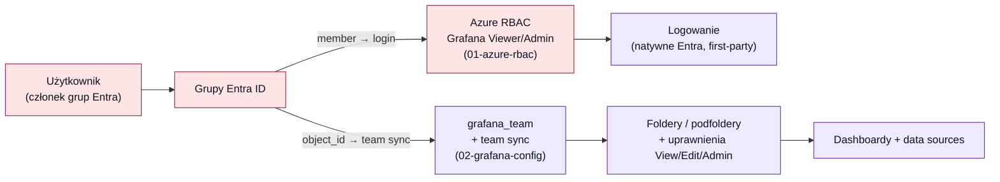

# 09 — Self-hosted Grafana: model dostępu (grupy Entra → role/foldery/dashboardy)

[◄ Analiza self-hosted](08-self-hosted-grafana-analysis.md) · [README](README.md) · [Licencje i koszty ►](10-grafana-licencje-koszty-oss-reconciler.md)

> Dokument analityczny, rozwinięcie [08](08-self-hosted-grafana-analysis.md) o **najbardziej
> krytyczny obszar: RBAC i logowanie użytkowników**. Analizuje, jak zrobiono to w
> [`../../managed_grafana_internal`](../../managed_grafana_internal) (dla Azure Managed
> Grafany) i jak zbudować **analogiczny model na self-hosted Grafanie w AKS**: mapowanie grup
> Entra ID na role, foldery, uprawnienia i dashboardy. Nie implementuje — rekomenduje i
> wskazuje twarde zależności.

---

## 0. TL;DR — dwie twarde zależności, których nie da się obejść „konfiguracją"

Model z `managed_grafana_internal` (grupa Entra → team → uprawnienia do folderów) **działa w
Azure Managed Grafanie, bo ta jest oparta o Grafana Enterprise i ma natywne logowanie Entra
bez rejestracji aplikacji**. Przeniesienie go 1:1 na self-hosted odsłania dwie zależności,
które są decyzjami biznesowymi/licencyjnymi, nie technicznymi detalami:

1. **Logowanie Entra (`[auth.azuread]`) wymaga rejestracji aplikacji w Entra ID** — a tego
   środowiska dziś **nie mogą utworzyć** (ten sam blocker, który wymusił usunięcie SP w
   [identity.tf:3-12](../grafana-poc-example/terraform/identity.tf#L3-L12) i
   [04](04-rbac-identity.md)). Managed Grafana tego nie potrzebowała, bo jest zasobem
   *first-party* Microsoftu. **Bez app registration nie ma logowania Entra, a więc nie ma
   żadnego mapowania grup.**
2. **Automatyczne mapowanie grup Entra → teamy Grafany (team sync) to funkcja Grafana
   Enterprise / Cloud**, nie OSS. Cały model uprawnień w
   [`02-grafana-config/teams.tf`](../../managed_grafana_internal/02-grafana-config/teams.tf)
   opiera się na `grafana_team_external_group` (team sync). **Na Grafanie OSS ten zasób nie
   zadziała** — trzeba albo licencji Enterprise, albo świadomej degradacji modelu (patrz §4).

Te dwie rzeczy trzeba rozstrzygnąć **przed** implementacją — determinują, czy w ogóle da się
odtworzyć model, czy tylko jego zgrubną wersję.

---

## 1. Jak to działa w managed_grafana_internal (stan faktyczny)

Repo świadomie dzieli problem na **dwie warstwy z rozdziałem obowiązków** (osobny state,
osobny SPN) — i README wprost deklaruje, że model jest **agnostyczny względem narzędzia, bo
docelowo zespół migruje do self-hosted**
([README](../../managed_grafana_internal/README.md)):

### Warstwa 1 — „kto w ogóle wchodzi i z jaką bazową rolą" ([`01-azure-rbac/`](../../managed_grafana_internal/01-azure-rbac))

- Provider `azurerm`. Dwie stałe grupy Entra z `terraform.tfvars` →
  `data "azuread_group"` → **`azurerm_role_assignment`** na zasobie Grafany:
  `Grafana Viewer` (grupa „wjazdowa") i `Grafana Admin` (wąska grupa adminów), obie
  **instance-wide** ([rbac_azure.tf:29-42](../../managed_grafana_internal/01-azure-rbac/rbac_azure.tf#L29-L42)).
- To działa **tylko dlatego, że Azure Managed Grafana ma natywną integrację Entra + Azure
  RBAC**: role `Grafana Admin/Editor/Viewer` to role Azure na zasobie ARM, a logowanie
  użytkownika obsługuje Azure bez żadnej app registration.
- Świadome ograniczenie v1: granularność per-system (kolumna `instance_role` w CSV) jest
  **wyłączona z egzekwowania** — role Azure są instance-wide, więc nie da się ich zawęzić do
  folderu ([rbac_azure.tf:1-18](../../managed_grafana_internal/01-azure-rbac/rbac_azure.tf#L1-L18)).

### Warstwa 2 — „co widzisz po wejściu" ([`02-grafana-config/`](../../managed_grafana_internal/02-grafana-config))

- Provider `grafana` (token przez `GRAFANA_AUTH`), **zero `azurerm`** — czysty rozdział.
- Źródło prawdy: [`rbac_input.csv`](../../managed_grafana_internal/02-grafana-config/rbac_input.csv)
  (płaski, 1 wiersz = 1 przypisanie grupy): `ra, system, environment, entra_group,
  entra_object_id, access_level, instance_role`.
- [`scripts/resolve_object_ids.sh`](../../managed_grafana_internal/02-grafana-config/scripts/resolve_object_ids.sh)
  uzupełnia `entra_object_id` przez `az ad group show` (jest wariant `.ps1`).
- [`groups.tf`](../../managed_grafana_internal/02-grafana-config/groups.tf) czyta CSV
  (`csvdecode`) i wylicza mapy: teamy, foldery systemów, podfoldery środowisk, uprawnienia +
  `check`i (niepuste object_id, poprawny `access_level`).
- Zasoby Grafany:
  - **`grafana_team`** — jeden na unikalną grupę Entra;
  - **`grafana_team_external_group`** — mapuje grupę Entra (`object_id`) na team = **team
    sync** ([teams.tf:10-15](../../managed_grafana_internal/02-grafana-config/teams.tf#L10-L15));
  - **`grafana_folder`** — folder systemu `(ra, system)` + zagnieżdżony podfolder
    `(ra, system, environment)` ([folders.tf:1-15](../../managed_grafana_internal/02-grafana-config/folders.tf#L1-L15));
  - **`grafana_folder_permission`** — team dostaje `View` na folderze systemu i
    `View/Edit/Admin` na podfolderze wg `access_level` z CSV
    ([folders.tf:17-45](../../managed_grafana_internal/02-grafana-config/folders.tf#L17-L45));
  - **`grafana_dashboard`** + **`grafana_data_source`** — dashboardy w podfolderach, DS
    TestData, oraz **read-only referencja** do auto-provisioned AMW Prometheus
    ([content.tf](../../managed_grafana_internal/02-grafana-config/content.tf)).

**Diagram łańcucha dostępu (managed dziś):**



---

## 2. Co przenosi się 1:1, co się zmienia, co jest zablokowane

| Element (managed) | Mechanizm dziś | Na self-hosted (AKS) | Status |
|---|---|---|---|
| Logowanie użytkownika przez Entra | Natywne, first-party (bez app-reg) | `grafana.ini [auth.azuread]` — **wymaga app registration** (client id/secret/redirect URI) | ⛔ **Zablokowane bez admina tenanta** (§3) |
| Bazowa rola „kto wchodzi" (Viewer/Admin) | `azurerm_role_assignment` na zasobie ARM (warstwa 1) | **Znika** — nie ma zasobu ARM. Zastępuje `[auth.azuread]` `allowed_groups` + `role_attribute_path`/`org_mapping` w grafana.ini | 🔁 **Zmiana mechanizmu** (warstwa 1 → config OAuth) |
| Grupa Entra → team | `grafana_team_external_group` (team sync) | Ten sam zasób providera, **ale team sync = Grafana Enterprise** | ⚠️ **Wymaga Enterprise** albo degradacji (§4) |
| Teamy / foldery / podfoldery / uprawnienia | `grafana_team`, `grafana_folder`, `grafana_folder_permission` | **Identyczne** — ten sam provider `grafana`, to samo API OSS | ✅ **Przenośne 1:1** |
| Dashboardy w folderach | `grafana_dashboard` | **Identyczne** | ✅ **Przenośne 1:1** |
| CSV + `resolve_object_ids` + `check`i | `csvdecode`, `az ad group show` | **Identyczne** — logika niezależna od typu Grafany | ✅ **Przenośne 1:1** |
| Auth Terraform do Grafany | `az grafana service-account token create` (CLI tylko dla managed) | Token SA z **API OSS** (`grafana_service_account` + `_token`, lub bootstrap admin) → `GRAFANA_AUTH` | 🔁 **Inny sposób mintowania tokenu** |
| Data source AMW Prometheus | auto-provisioned integracją Azure, referencja read-only | **Trzeba go stworzyć samemu** (workload identity, patrz [08 §4.1](08-self-hosted-grafana-analysis.md)) — nie ma auto-provisioningu | 🔁 **Tworzymy jawnie** |

**Wniosek:** **cała warstwa 2** (`02-grafana-config`: CSV, teamy, foldery, uprawnienia,
dashboardy) jest **przenośna niemal bez zmian** — to był świadomy zamysł autorów. Zmienia się
**warstwa 1** (logowanie + bazowa rola: z Azure RBAC na konfigurację OAuth w grafana.ini) i
**sposób uwierzytelniania Terraforma** do Grafany. Dwa realne blokery to **app registration**
i **team sync (Enterprise)**.

---

## 3. Blocker #1 — logowanie Entra wymaga rejestracji aplikacji

Self-hosted Grafana loguje przez Entra tylko z `[auth.azuread]`, co wymaga **app
registration** w Entra ID: `client_id`, `client_secret`, redirect URI
`https://<grafana>/login/azuread`, oraz — **kluczowe dla mapowania grup** — skonfigurowanego
**claimu grup** (`groupMembershipClaims`) w manifeście aplikacji.

- To ten sam typ obiektu, którego środowisko **nie mogło utworzyć** przez Terraform
  ([identity.tf:3-12](../grafana-poc-example/terraform/identity.tf#L3-L12)) — brak roli
  *Application Administrator* / „users can register applications" wyłączone.
- **Nie da się tego obejść po stronie Grafany.** Odblokowuje to wyłącznie **admin tenanta**,
  tworząc jedną app registration (krok ręczny, poza tym Terraform — `azuread` i tak padnie na
  obecnych uprawnieniach).
- **Pułapka „group overage":** jeśli użytkownik należy do > ~200 grup, Entra nie wyśle claimu
  grup, tylko wskaźnik nadmiaru → Grafana musi dobrać grupy z Microsoft Graph, co wymaga
  dodatkowego uprawnienia aplikacji (`GroupMember.Read.All` / `Directory.Read.All`). Przy
  dużej liczbie grup w organizacji to realny problem — do rozstrzygnięcia z adminem tenanta.

**Jeśli app registration jest niedostępna:** logowanie Entra odpada, a z nim **całe mapowanie
grup**. Zostaje lokalny admin — czyli PoC bez modelu dostępu z CSV. To trzeba powiedzieć
wprost: **bez app registration wymaganie „mapowanie grup Entra na role/foldery" jest
niewykonalne** na self-hosted, niezależnie od licencji Grafany.

---

## 4. Blocker #2 — mapowanie grup na uprawnienia folderów wymaga Enterprise (team sync)

Nawet mając logowanie Entra, trzeba **z członkostwa w grupie zrobić uprawnienie do konkretnego
folderu/systemu**. Są trzy poziomy granularności — i tylko część działa w OSS:

| Poziom | Co potrafi | OSS? | Uwaga |
|---|---|---|---|
| **Org role z claimu** (`role_attribute_path`, `org_mapping` w `[auth.azuread]`) | Mapuje grupę → **globalna** rola Viewer/Editor/Admin (całej instancji) | ✅ OSS | Zbyt zgrubne — to jest dokładnie ten problem „instance-wide", który warstwa 1 w managed świadomie zaakceptowała jako kompromis |
| **Team sync** (`grafana_team_external_group`) → uprawnienia folderów per team | Grupa Entra → team → `View/Edit/Admin` na **konkretnym podfolderze** (dokładnie model z CSV) | ⛔ **Enterprise/Cloud** | **To jest serce modelu managed_grafana_internal** |
| **Fine-grained RBAC** (`grafana_role`, role custom) | Uprawnienia na poziomie zasobów | ⛔ Enterprise | Nie jest tu potrzebne, ale też Enterprise |

Sedno: **granularne, per-system uprawnienia z `rbac_input.csv` (View/Edit/Admin na podfolderze
danego środowiska) wymagają team sync = Grafana Enterprise.** Azure Managed Grafana miała to
za darmo (jest oparta o Enterprise). Self-hosted OSS tego nie ma.

**Opcje:**

- **(Rekomendacja przy wymaganiu parytetu) Grafana Enterprise** (licencja) lub **Grafana
  Cloud** — wtedy warstwa 2 z `managed_grafana_internal` przenosi się **niemal 1:1** (ten sam
  provider, te same zasoby, to samo CSV). To jedyna droga do wiernej kopii modelu grupowego.
- **OSS + degradacja do org-role** — mapujemy grupy tylko na globalne role Viewer/Editor/Admin
  (`org_mapping`). Tracimy per-system/per-folder granularność. Akceptowalne dla PoC, **nie**
  spełnia wymagania „foldery/uprawnienia per grupa".
- **OSS + własny reconciler** — kontroler, który czyta członkostwo grup z Microsoft Graph i
  przez API Grafany synchronizuje członkostwo teamów (reimplementacja team sync). Wykonalne,
  ale to **własny kod do utrzymania** — świadoma decyzja, nie „konfiguracja".

---

## 5. Realia źródeł danych — dużo, różnych (AKS, Azure, on-prem)

Twoja uwaga „będzie bardzo wiele różnych źródeł danych" zmienia rozdz. [08 §4.1](08-self-hosted-grafana-analysis.md)
z „parytet 4 DS" na **model rozszerzalny**. Kategorie i jak każda się uwierzytelnia/łączy:

| Kategoria | Przykłady | Auth | Łączność z poda w AKS |
|---|---|---|---|
| **In-cluster (AKS)** | self-hosted Prometheus, Loki, Tempo w klastrze | brak / token k8s | `http://<svc>.monitoring.svc.cluster.local` — bezpośrednio |
| **Azure Monitor / AMW** | AMW-A/B, Azure Monitor, Log Analytics | **Workload Identity** (UAMI, [08 §4.1](08-self-hosted-grafana-analysis.md)) | query endpoint AMW; AMW-A prywatnie przez PE (strefa DNS zlinkowana do vnet-lab) |
| **On-prem** | Prometheus/Thanos, SQL, Elastic w DC | secret w Key Vault (CSI) lub mTLS | wymaga **prywatnej ścieżki**: ExpressRoute / VPN / Private Endpoint + DNS; z klastra przez peering/route |

Konsekwencje dla projektu (uzupełniają [08](08-self-hosted-grafana-analysis.md)):

- **Provisioning DS musi być rozszerzalny**, nie zahardkodowany na 4 wpisy. Rekomendacja:
  **te same wzorce co RBAC** — źródła danych deklaratywnie (albo w `values.yaml`
  `datasources`, albo — spójnie z warstwą 2 — jako `grafana_data_source` w Terraformie z
  providerem `grafana`, tak jak w [content.tf](../../managed_grafana_internal/02-grafana-config/content.tf)).
- **On-prem to osobny problem sieciowy** (prywatna łączność DC↔AKS) — nie rozwiązuje go sama
  Grafana; wymaga ExpressRoute/VPN i DNS. Do rozplanowania niezależnie.
- **Sekrety on-prem** (hasła DB, tokeny) → **Azure Key Vault + CSI Secrets Store** (jak
  [08 §4.3](08-self-hosted-grafana-analysis.md)); nigdy w repo/values/stanie.
- **Dashboardy** referencjonują DS po **UID** — przy wielu źródłach re-mapowanie UID
  ([08 §4.2](08-self-hosted-grafana-analysis.md)) staje się jeszcze ważniejsze; utrzymywać
  jeden rejestr `name→uid→type` dla wszystkich źródeł.

---

## 6. Rekomendowana architektura docelowa (analogiczna, dwuwarstwowa)

Zachowujemy filozofię `managed_grafana_internal` — **rozdział „kto wchodzi" od „co widzi"** —
i przenosimy ją na self-hosted:

```
self-hosted Grafana (AKS, Helm — patrz 08)
│
├── Warstwa 1: „kto wchodzi + bazowa rola"   →  NIE Azure RBAC, lecz grafana.ini
│     [auth.azuread]                             (Helm values / Secret z app-reg):
│       client_id / client_secret (Key Vault CSI)
│       allowed_groups = <grupy wjazdowe>
│       role_attribute_path / org_mapping = grupa → Viewer/Admin (baseline)
│
└── Warstwa 2: „co widzi"                     →  Terraform provider `grafana`
      (PRZENIESIONE z 02-grafana-config, niemal 1:1)
        rbac_input.csv  →  grafana_team (+ team sync*)  →  foldery/podfoldery
                            grafana_folder_permission (View/Edit/Admin z CSV)
                            grafana_dashboard, grafana_data_source
        * team sync wymaga Grafana Enterprise (§4)
```

- **Warstwa 2 = re-użycie istniejącego kodu.** `02-grafana-config` wskazuje URL Grafany przez
  zmienną — wystarczy skierować provider `grafana` na self-hosted (`grafana_url` = wewnętrzny
  URL / port-forward), dostarczyć `GRAFANA_AUTH` (token SA z API OSS) i — o ile jest Enterprise
  — `teams.tf` zadziała bez zmian. CSV, `resolve_object_ids`, `check`i: bez zmian.
- **Warstwa 1 przenosi się z Azure RBAC do grafana.ini.** Zamiast dwóch
  `azurerm_role_assignment` — sekcja `[auth.azuread]` z `allowed_groups` (bramka logowania) i
  `org_mapping` (bazowa rola). To wymaga app-reg (§3).
- **Uwspólnienie z resztą:** warstwa 2 to Terraform (jak `managed_grafana_internal`), a
  instalacja samej Grafany to Helm (jak Prometheus, [08 §3](08-self-hosted-grafana-analysis.md)).
  Dwie się to godzi: Helm stawia *instancję* (deployment, auth, DS bazowe), Terraform
  `grafana` zarządza *zawartością* (teamy/foldery/uprawnienia/dashboardy) — dokładnie ten sam
  podział „platforma vs treść", co w repo managed.

---

## 7. Rekomendacja

1. **Rozstrzygnij oba blokery zanim zaczniesz** — to decyzje zewnętrzne, nie kod:
   - poproś **admina tenanta o jedną app registration** dla self-hosted Grafany (login +
     claim grup); bez niej mapowanie grup jest niewykonalne;
   - potwierdź **licencję Grafana Enterprise** (lub Grafana Cloud); bez niej per-folderowy
     model z CSV degraduje się do globalnych ról org.
2. **Gdy oba dostępne:** przenieś warstwę 2 z
   [`02-grafana-config`](../../managed_grafana_internal/02-grafana-config) niemal 1:1
   (provider `grafana` na self-hosted, to samo CSV), a warstwę 1 zrealizuj w `[auth.azuread]`
   w Helm values. To daje **wierną kopię** modelu dostępu.
3. **Gdy app-reg niedostępna:** PoC z lokalnym adminem, **bez** modelu grupowego — i wyraźnie
   zaznacz, że to nie jest parytet (patrz [08 §4.6](08-self-hosted-grafana-analysis.md)).
4. **Gdy app-reg jest, ale bez Enterprise:** logowanie Entra + `org_mapping` na globalne role;
   udokumentuj utratę granularności per-system jako świadomy kompromis (analogicznie do v1
   warstwy 1 w managed).
5. **Źródła danych** projektuj jako **rozszerzalny rejestr** (nie 4 wpisy) z trzema klasami
   auth/łączności (in-cluster / Azure WI / on-prem przez KV+prywatną sieć) — §5.

---

## 8. Otwarte pytania / decyzje do potwierdzenia

1. **App registration** — czy admin tenanta utworzy ją dla self-hosted Grafany (login + claim
   grup, ewentualnie uprawnienie Graph na „group overage")? **Bez tego brak mapowania grup.**
2. **Licencja Grafany** — Enterprise/Cloud (parytet modelu z CSV) czy OSS (degradacja do
   globalnych ról org)? To rozstrzyga, czy `grafana_team_external_group` w ogóle zadziała.
3. **Re-użycie warstwy 2** — kierujemy istniejący `02-grafana-config` na self-hosted (jeden
   model dostępu dla obu Grafan), czy tworzymy osobną kopię w tym repo?
4. **Zakres źródeł danych on-prem** — jakie konkretnie (Prometheus/Thanos, SQL, Elastic…) i
   czy istnieje już prywatna łączność DC↔AKS (ExpressRoute/VPN)? To osobny strumień prac.
5. **„Group overage"** — czy użytkownicy należą do > ~200 grup? Jeśli tak, app-reg musi mieć
   uprawnienie Graph, inaczej claim grup będzie niekompletny.
6. **Token dla Terraforma** (warstwa 2) — mintujemy service-account token z API OSS w skrypcie
   (analog do `az grafana service-account token create` z managed), czy trzymamy inaczej?
