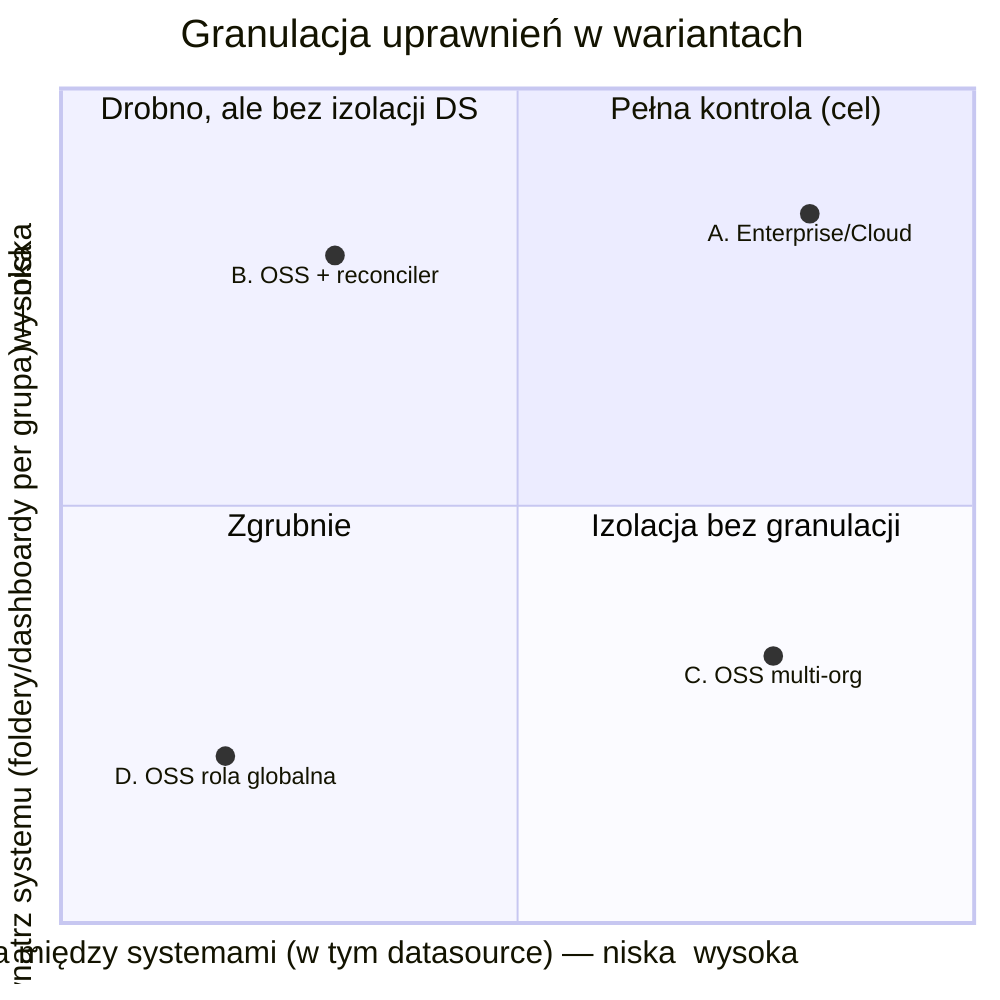
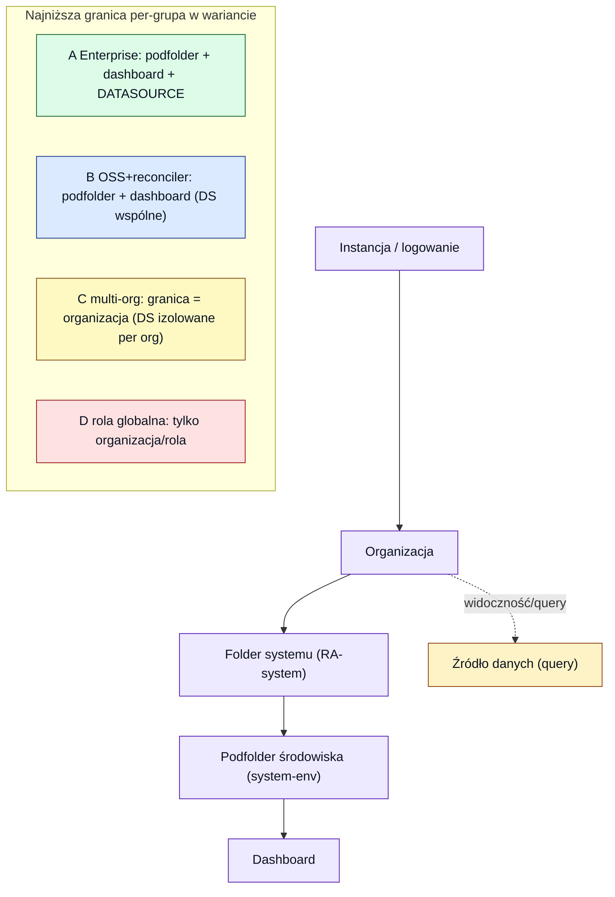

# 11 — Granulacja uprawnień (foldery, dashboardy, datasource) w wariantach

[◄ Licencje i koszty](10-grafana-licencje-koszty-oss-reconciler.md) · [README](README.md) · [Reconciler ►](12-reconciler-architektura-mechanizmy.md)

> Dokument analityczny. Porównuje **granulację uprawnień** do folderów, dashboardów i źródeł
> danych w wariantach z [09](09-selfhosted-rbac-entra-model.md) i
> [10](10-grafana-licencje-koszty-oss-reconciler.md). Kontekst: **użytkowników i systemów
> będzie dużo** — więc decydująca przestaje być cena per-user, a staje się **izolacja między
> systemami**, zwłaszcza na poziomie źródeł danych.

---

## 0. TL;DR — jedna oś przesądza wszystko: izolacja datasource

Przy wielu systemach kluczowe pytanie brzmi: **czy system A ma NIE widzieć/odpytywać danych
systemu B?** Odpowiedź rozstrzyga wybór wariantu, bo trzy osie granulacji zachowują się
zupełnie różnie:

- **Foldery i dashboardy** — granularne per grupa **w każdym wariancie OSS** (foldery
  zagnieżdżone + uprawnienia folderów są GA w OSS od Grafany 11).
- **Role** — OSS ma tylko **basic roles** (Viewer/Editor/Admin). **Fixed i custom roles**
  (fine-grained RBAC, np. `grafana_role`) to **wyłącznie Enterprise/Cloud** — to ta sama
  warstwa, która daje datasource permissions i team sync.
- **Źródła danych (query)** — **nie da się ograniczyć per zespół/grupa w OSS**. Domyślnie
  *każdy użytkownik w organizacji odpytuje każde źródło danych w tej organizacji*. Ograniczenie
  query per team/rola to funkcja **wyłącznie Grafana Enterprise / Cloud**.
- **Logowanie / rola bazowa** — mapowalne z grup we wszystkich wariantach (różnymi
  mechanizmami).

Stąd wniosek: jeśli **wymagana jest izolacja źródeł danych** między systemami, OSS daje ją
**tylko przez multi-org** (ciężkie operacyjnie, duplikacja, brak współdzielenia) — albo trzeba
**Enterprise/Cloud**. Jeśli izolacja datasource **nie** jest wymagana (wszyscy mogą odpytywać
wszystkie źródła, różni się tylko widoczność folderów/dashboardów), **OSS + reconciler**
(`grafana-oss-team-sync`, [10](10-grafana-licencje-koszty-oss-reconciler.md)) w pełni
wystarcza i skaluje się tanio z liczbą userów.

---

## 1. Warianty (z analizy 09–10)

| # | Wariant | Logowanie / mapowanie grup | Licencja |
|---|---|---|---|
| **A** | **Enterprise / Cloud** — natywny team sync | Entra + team sync (grupa→team) | Enterprise/Cloud (płatne) |
| **B** | **OSS + reconciler** (`grafana-oss-team-sync`) | Entra OAuth + narzędzie synchronizuje teamy/foldery | OSS (darmowe) + kod |
| **C** | **OSS + `org_mapping`** (multi-org: 1 system = 1 organizacja) | Entra OAuth, grupa→org+rola | OSS (darmowe) |
| **D** | **OSS + `role_attribute_path`** (jedna org, tylko rola globalna) | Entra OAuth, grupa→globalna rola | OSS (darmowe) |

---

## 2. Diagram 1 — mapa granulacji (izolacja między systemami × granulacja wewnątrz systemu)

Dwie osie, które naprawdę różnicują warianty. **Oś X:** jak mocno wariant izoluje systemy od
siebie (szczególnie datasource). **Oś Y:** jak drobno różnicuje uprawnienia *wewnątrz* systemu
(foldery/podfoldery/dashboardy per grupa).

Czytanie mapy:

- **A (prawy-górny, cel)** — drobna granulacja *i* izolacja datasource. To model, który dziś
  daje Azure Managed Grafana (oparta o Enterprise).
- **B (lewy-górny)** — drobne foldery/dashboardy per grupa (jak w
  [`rbac_input.csv`](../../managed_grafana_internal/02-grafana-config/rbac_input.csv)),
  **ale wszystkie źródła danych są wspólne** — brak izolacji DS.
- **C (prawy-dolny)** — twarda izolacja (każdy system to osobna org z własnymi DS/folderami),
  **ale wewnątrz org tylko role globalne** (Viewer/Editor/Admin) i duplikacja treści.
- **D (lewy-dolny)** — najzgrubniej: jedna org, rola globalna z claimu; brak realnej
  segmentacji.

---

## 3. Diagram 2 — gdzie każdy wariant potrafi wymusić granicę „per grupa"

Hierarchia zawierania w Grafanie i **najniższy poziom, na którym dany wariant potrafi nadać
uprawnienie konkretnej grupie Entra**:

Im niżej w hierarchii (Instancja → … → Datasource) wariant potrafi zejść z uprawnieniem
per-grupa, tym drobniejsza kontrola. Tylko **A** dosięga poziomu datasource; **B** kończy na
folderze/dashboardzie; **C** izoluje dopiero na granicy organizacji; **D** operuje na roli
globalnej.

---

## 4. Macierz porównawcza (fakty)

| Oś granulacji | A. Enterprise/Cloud | B. OSS + reconciler | C. OSS multi-org | D. OSS rola globalna |
|---|---|---|---|---|
| **Kto się loguje** (bramka po grupie) | ✅ team sync / SSO | ✅ `allow_sign_up=false` + sync | ✅ `org_mapping` | ✅ `role_attribute_path` |
| **Rola bazowa z grupy** | ✅ per team/org | ✅ globalna + per folder | ✅ per org | ✅ tylko globalna |
| **Foldery/podfoldery zagnieżdżone** | ✅ (do 4 poziomów) | ✅ OSS ≥11 (do 4 poziomów) | ✅ per org | ✅ ale bez segmentacji grup |
| **Uprawnienia folderu per grupa (View/Edit/Admin)** | ✅ team sync | ✅ narzędzie nadaje per team | ⚠️ tylko role org (w danej org) | ❌ tylko rola globalna |
| **Uprawnienia dashboardu per grupa** | ✅ | ✅ (ACL OSS) | ⚠️ per org | ❌ |
| **Izolacja query datasource per grupa/system** | ✅ **datasource permissions** | ❌ **brak w OSS — wszystkie DS wspólne w org** | ✅ przez granicę org (własne DS per org) | ❌ |
| **Custom / fixed roles (fine-grained RBAC)** | ✅ **Enterprise/Cloud** — własne role (actions+scopes), `grafana_role` | ❌ tylko basic roles (Viewer/Editor/Admin) | ❌ tylko basic roles | ❌ tylko basic roles |
| **Współdzielenie dashboardów/DS między systemami** | ✅ | ✅ (jedna org) | ❌ duplikacja per org | ✅ (jedna org) |
| **Mapowanie członkostwa z Entra (auto)** | ✅ natywne | ✅ przez Graph→API (narzędzie/CronJob) | ✅ przy logowaniu (`org_mapping`) | ✅ przy logowaniu |
| **Nakład/koszt** | licencja (patrz [10](10-grafana-licencje-koszty-oss-reconciler.md)) | darmowe + utrzymanie kodu | darmowe, ale ciężkie operacyjnie | darmowe, trywialne |

Legenda: ✅ pełne · ⚠️ ograniczone/zgrubne · ❌ brak.

---

## 5. Konsekwencje przy „dużo użytkowników i systemów"

1. **Cena per-user przestaje być argumentem za OSS jednoznacznie** — powyżej progu
   ~70–140 aktywnych userów OSS i tak wygrywa kosztem z Azure Managed
   ([10](10-grafana-licencje-koszty-oss-reconciler.md)), ale przy „dużo" liczy się głównie
   **model uprawnień**, nie stawka.
2. **Rozstrzyga wymóg izolacji datasource.** To jedno pytanie dzieli decyzję:
   - **Izolacja DS wymagana** (system A nie może odpytać danych systemu B) → OSS daje ją
     **tylko multi-org (C)**, a to przy *wielu* systemach oznacza duplikację dashboardów/DS,
     brak współdzielenia i uciążliwe przełączanie organizacji. Praktycznie: **przy wielu
     systemach z izolacją DS pragmatycznym wyborem staje się Enterprise/Cloud (A)** — mimo
     kosztu, bo daje izolację DS *bez* rozbijania na organizacje.
   - **Izolacja DS niewymagana** (różni się tylko widoczność folderów/dashboardów, wszyscy
     mogą odpytać wszystkie źródła) → **OSS + reconciler (B)** skaluje się do dużej liczby
     userów i systemów, tanio, z pełną granulacją folderów per grupa. To nadal rekomendacja z
     [10](10-grafana-licencje-koszty-oss-reconciler.md).
3. **Wariant hybrydowy** (świadomie, jeśli zajdzie potrzeba): większość systemów w jednej org
   (B, wspólne DS), a nieliczne wymagające twardej izolacji DS — w osobnych organizacjach (C).
   Złożoność operacyjna rośnie; rozważać tylko gdy izolacji potrzebuje mniejszość systemów.

---

## 6. Rekomendacja warunkowa

- **Jeśli izolacja query datasource między systemami jest wymogiem** (typowe w multi-tenant,
  compliance, dane wrażliwe różnych klientów) → **A. Enterprise/Cloud**. Przy „dużo systemów"
  multi-org (C) jest operacyjnie nie do utrzymania, a to jedyna darmowa alternatywa dająca
  izolację DS.
- **Jeśli izolacja datasource NIE jest wymogiem** → **B. OSS + reconciler** — pełna granulacja
  folderów/dashboardów per grupa, skaluje się tanio, spójne z modelem `rbac_input.csv`.
- **D** (rola globalna) tylko jako baseline/PoC. **C** (multi-org) — jako izolacja gdy nie ma
  budżetu na Enterprise, ze świadomością kosztu operacyjnego przy wielu systemach.

---

## 7. Otwarte pytania

1. **Czy wymagana jest izolacja query datasource między systemami?** To pytanie #1 —
   rozstrzyga A vs B (patrz §5.2). Trzeba je zadać właścicielom systemów wprost.
2. **Ile realnie systemów/RA i jak bardzo rozłącznych** (wspólne źródła vs per-system)? Determinuje,
   czy multi-org (C) jest w ogóle rozważalne.
3. **Czy dane różnych systemów mają wymogi compliance** (rozdział, audyt dostępu do DS)? Jeśli
   tak — de facto wymusza A.
4. **Model hybrydowy** — czy jest apetyt na jedną org (B) + wyjątki w osobnych org (C) dla
   nielicznych systemów wrażliwych, czy trzymamy jeden spójny model?

---

## Źródła (dostęp 2026-07-20)

- Data source permissions = Enterprise/Cloud; w OSS każdy user w org odpytuje każde źródło:
  [Roles and permissions — Grafana docs](https://grafana.com/docs/grafana/latest/administration/roles-and-permissions/),
  [Data source security best practices — Grafana Labs](https://grafana.com/blog/2024/05/06/data-source-security-in-grafana-best-practices-and-what-to-avoid/).
- Subfoldery (do 4 poziomów) GA w OSS od Grafany 11; uprawnienia folderów we wszystkich
  edycjach; kaskadowanie w dół:
  [Subfolders — Grafana Labs](https://grafana.com/whats-new/2024-02-27-subfolders/),
  [Folder access control — Grafana docs](https://grafana.com/docs/grafana/latest/administration/roles-and-permissions/folder-access-control/).
- `grafana-oss-team-sync` (wariant B): [github.com/skuethe/grafana-oss-team-sync](https://github.com/skuethe/grafana-oss-team-sync).
