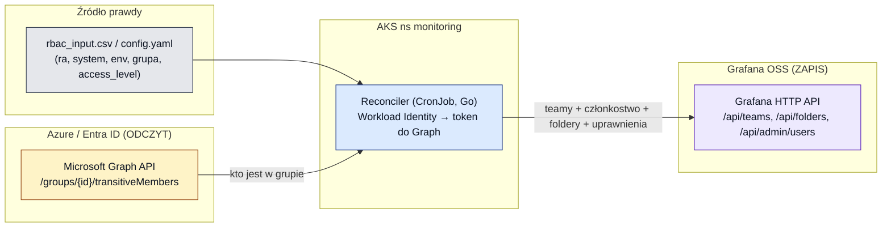

# 12 — Reconciler grup Entra → Grafana OSS: jak działa i na jakich mechanizmach

[◄ Granulacja uprawnień](11-granulacja-uprawnien-warianty.md) · [README](README.md) · [Loki: wpływ na self-hosted ►](13-loki-wplyw-na-self-hosted-i-izolacje.md)

> Dokument techniczny. Wyjaśnia **jak działałby reconciler** z wariantu B
> ([10](10-grafana-licencje-koszty-oss-reconciler.md), [11](11-granulacja-uprawnien-warianty.md)) —
> na przykładzie gotowego FOSS [`grafana-oss-team-sync`](https://github.com/skuethe/grafana-oss-team-sync) —
> jakie ma funkcjonalności i **którymi wbudowanymi mechanizmami Grafany i Azure** je realizuje.
> Fakty o narzędziu z jego dokumentacji (dostęp 2026-07-21).

---

## 0. Idea w jednym zdaniu

Reconciler to **bezstanowy proces uruchamiany cyklicznie** (CronJob w AKS), który **czyta
prawdę o dostępach z dwóch źródeł** — modelu deklaratywnego (`rbac_input.csv` /
`config.yaml`) i **członkostwa grup z Microsoft Entra ID** — a następnie **doprowadza stan
Grafany do zgodności** przez jej **HTTP API** (teamy, użytkownicy, foldery, uprawnienia).
Model jest **autorytatywny (override)**: co nie wynika ze źródła, jest w Grafanie cofane.

To dokładnie zastępuje **team sync** z Enterprise — tyle że robione „z zewnątrz" przez API,
zamiast wbudowane w Grafanę.

---

## 1. Dwie powierzchnie integracji



- **Strona Azure = tylko ODCZYT** członkostwa grup (Graph API).
- **Strona Grafana = ZAPIS** stanu (HTTP API).
- **Reconciler** spina je, mapując model `(ra, system, environment, grupa, access_level)` na
  obiekty Grafany.

---

## 2. Pętla reconcile (przepływ)

```mermaid
sequenceDiagram
  participant CJ as CronJob (AKS)
  participant EN as Microsoft Graph
  participant GR as Grafana API
  CJ->>CJ: wczytaj config (grupy, foldery, access_level)
  CJ->>EN: dla każdej grupy: GET /groups/{id}/transitiveMembers
  EN-->>CJ: pełna lista userów (bez limitu „group overage")
  CJ->>GR: upsert team per grupa (GET/POST /api/teams)
  opt sync użytkowników (wymaga basic auth)
    CJ->>GR: utwórz brakujących userów (POST /api/admin/users)
  end
  CJ->>GR: ustaw członkostwo teamu (bulk, Grafana ≥11.1)
  CJ->>GR: upsert folderów (POST /api/folders)
  CJ->>GR: nadpisz uprawnienia folderu (POST /api/folders/{uid}/permissions)
  Note over GR: stan = źródło prawdy; ręczne zmiany cofnięte
```

Bezstanowość: reconciler nie trzyma własnego stanu — przy każdym przebiegu liczy „stan
pożądany" ze źródła i **nadpisuje** stan w Grafanie (członkostwo teamów i listy uprawnień
folderów są zastępowane w całości).

---

## 3. Funkcjonalności i którym mechanizmem realizowane

| Funkcjonalność | Mechanizm Grafany (wbudowany) | Mechanizm Azure |
|---|---|---|
| **Team per grupa Entra** | `GET/POST /api/teams` | — |
| **Członkostwo teamu = członkowie grupy** | bulk *set team members* (endpoint z Grafany **≥11.1.0**) | `GET /groups/{id}/transitiveMembers` (Graph) |
| **Tworzenie brakujących userów** | **Admin API** `POST /api/admin/users` (**wymaga basic auth**) | `User.ReadBasic.All` (Graph) |
| **Foldery / podfoldery systemów** | `POST /api/folders` (zagnieżdżone, OSS ≥11) | — |
| **Uprawnienia folderu (View/Edit/Admin) per team** | `POST /api/folders/{uid}/permissions` (nadpisanie listy) | — |
| **Bramka logowania (tylko zsynchronizowani)** | `allow_sign_up=false` w `[auth.azuread]` | app registration (OAuth) |
| **Deprovisioning** (odebranie dostępu) | override: usunięcie z grupy → znika z teamu przy następnym przebiegu | `transitiveMembers` już go nie zwraca |

Uwaga: uprawnienia są **nadpisywane w całości** przy każdym przebiegu — to celowe (jedno
źródło prawdy, brak dryfu od ręcznych zmian w UI).

---

## 4. Uwierzytelnianie — dwa styki, dwie decyzje

### 4.1. Reconciler → Grafana (zapis)

Dwie opcje, z realnym kompromisem:

- **Service-account token** (`GRAFANA_AUTH`) — zgodne z modelem „zero sekretów user/pass",
  spójne z [managed_grafana_internal](../../managed_grafana_internal/README.md). **ALE**:
  token **nie może tworzyć userów** (Admin API wymaga basic auth). Wtedy userzy muszą powstać
  **JIT przy pierwszym logowaniu OAuth**, a reconciler tylko synchronizuje członkostwo już
  istniejących.
- **Basic auth (admin user/hasło)** — pozwala **pre-tworzyć userów** (`/api/admin/users`), więc
  team ma komplet od razu, nawet przed pierwszym logowaniem. Kosztem trzymania poświadczeń
  admina (Key Vault + CSI).

**Rekomendacja:** token SA + poleganie na JIT z OAuth (userzy pojawiają się przy pierwszym
logowaniu Entra, [09](09-selfhosted-rbac-entra-model.md)), chyba że wymagane jest, by team
miał komplet członków, którzy jeszcze się nie zalogowali — wtedy basic auth.

### 4.2. Reconciler → Microsoft Graph (odczyt)

- Narzędzie w wersji upstream używa **client credentials**: `CLIENT_ID` / `TENANT_ID` /
  `CLIENT_SECRET`, z uprawnieniami aplikacji **`User.ReadBasic.All` + `GroupMember.Read.All`**
  (z admin consent).
- **To ta sama app registration**, którą i tak potrzebujemy do logowania OAuth
  ([09](09-selfhosted-rbac-entra-model.md), §3) — dokładamy jej tylko uprawnienia Graph.
- ⚠️ **Sekret vs Workload Identity:** upstream oczekuje `CLIENT_SECRET` (sekret klienta). Żeby
  uzyskać *bezsekretowe* uwierzytelnianie zgodne z [08 §4.1](08-self-hosted-grafana-analysis.md)
  (UAMI + AKS Workload Identity), trzeba albo (a) trzymać `CLIENT_SECRET` w **Key Vault + CSI**
  i wstrzykiwać jako env, albo (b) **zaadaptować narzędzie** do `DefaultAzureCredential`
  (federated token z `AZURE_FEDERATED_TOKEN_FILE`). To realny punkt do rozstrzygnięcia —
  gotowiec nie robi WI „z pudełka".

---

## 5. Dlaczego odczyt z Graph omija problem „group overage"

Logowanie OAuth ma limit **claimu grup** (~200 — [09 §3](09-selfhosted-rbac-entra-model.md)):
przy większej liczbie grup token nie niesie pełnej listy. **Reconciler tego nie dotyczy** —
czyta członkostwo **wprost z Graph** (`/groups/{id}/transitiveMembers`), więc dostaje pełną
listę niezależnie od liczby grup usera. To istotna przewaga architektury „odczyt z Graph +
zapis do teamów" nad poleganiem wyłącznie na claimie grup w tokenie logowania.

---

## 6. Uruchomienie w AKS (spójnie z resztą PoC)

- **CronJob** w namespace `monitoring` (ten sam, co Prometheus i Grafana,
  [08](08-self-hosted-grafana-analysis.md)), np. co 15–30 min; obraz kontenera narzędzia.
- **Tożsamość do Graph:** SA poda z adnotacją Workload Identity (UAMI z federacją,
  [08 §4.1](08-self-hosted-grafana-analysis.md)) — o ile zaadaptujemy tool do WI (§4.2);
  inaczej sekret z Key Vault + CSI.
- **`config.yaml`** generowany z `rbac_input.csv` (to samo źródło prawdy co
  [managed_grafana_internal](../../managed_grafana_internal/02-grafana-config/rbac_input.csv)) —
  mapa `grupa → team → folder(system) → podfolder(env) → View/Edit/Admin`.
- **Obserwowalność:** logi CronJoba + metryki (sukces/porażka przebiegu) do Prometheusa;
  **dry-run** przed pierwszym „ostrym" przebiegiem.
- **Idempotencja:** z natury — override do stanu pożądanego przy każdym przebiegu.

---

## 7. Czego reconciler NIE zrobi (granice wariantu B)

To wciąż **OSS**, więc reconciler operuje tylko na tym, co OSS oferuje przez API
([11](11-granulacja-uprawnien-warianty.md)):

- ❌ **Nie da izolacji query datasource** — w OSS każdy user w organizacji odpytuje każde
  źródło; API nie ma per-team datasource permissions. Reconciler nie obejdzie braku funkcji.
- ❌ **Nie utworzy custom/fixed roles** — to fine-grained RBAC (Enterprise/Cloud).
- ✅ Realizuje: teamy z Entry, foldery/podfoldery, uprawnienia folderów/dashboardów
  (View/Edit/Admin) — czyli **pełen model `rbac_input.csv` z wyjątkiem warstwy datasource**.

Jeśli izolacja datasource jest wymogiem → to nie kwestia reconcilera, tylko licencji
(Enterprise, wariant A) lub multi-org (wariant C) — patrz [11 §5](11-granulacja-uprawnien-warianty.md).

---

## 8. Otwarte pytania

1. **Auth do Grafany:** token SA (bez tworzenia userów, JIT z OAuth) czy basic auth (pełny
   sync userów, sekret admina w Key Vault)? (§4.1)
2. **Auth do Graph:** adaptujemy narzędzie do Workload Identity (bezsekretowo) czy trzymamy
   `CLIENT_SECRET` w Key Vault + CSI? (§4.2)
3. **Adopcja vs fork:** bierzemy `grafana-oss-team-sync` as-is (GPL-3.0) i tylko dokładamy WI,
   czy piszemy własny mały reconciler (pełna kontrola, większy nakład — [10](10-grafana-licencje-koszty-oss-reconciler.md))?
4. **Częstotliwość i model błędów:** interwał CronJoba, zachowanie przy niedostępności Graph /
   Grafany (retry, brak częściowego nadpisania).
5. **Generowanie `config.yaml`** z `rbac_input.csv` — jednorazowy skrypt czy stały krok w
   pipeline?
