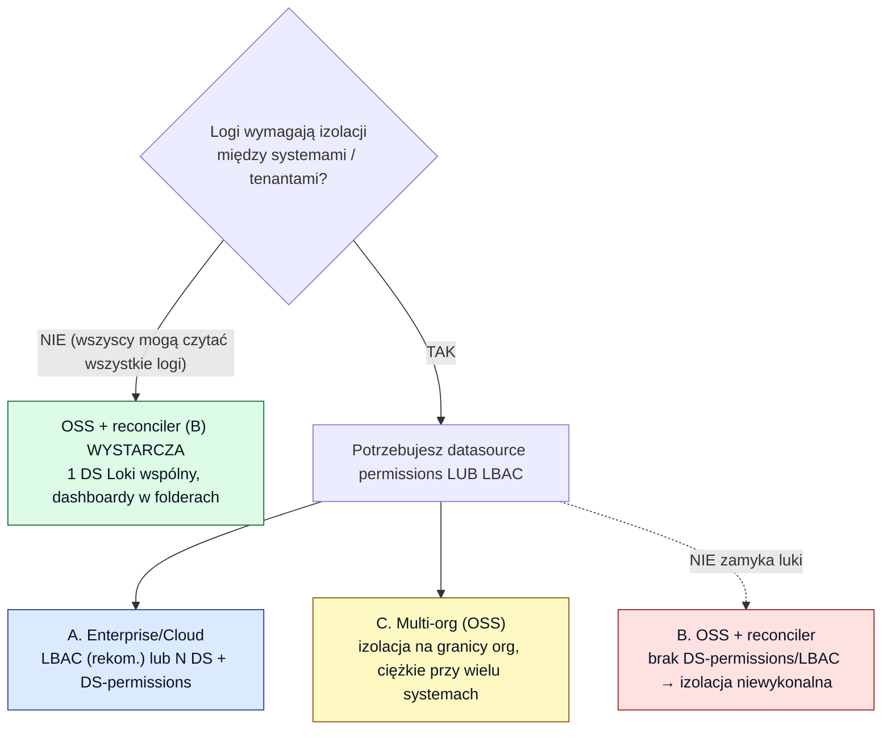

# 13 — Loki: wpływ na self-hosted Grafanę i na izolację (OSS vs Enterprise)

[◄ Reconciler](12-reconciler-architektura-mechanizmy.md) · [README](README.md) · [Alternatywy dla Grafany ►](14-alternatywy-dla-grafany-rbac.md)

> Dokument analityczny. Odpowiada na dwa pytania: **(1) jak wprowadzenie Loki zmienia całą
> analizę self-hosted (dok. 08–12)** i **(2) jakie źródła Loki potrafi zintegrować, a jakich
> nie**. Uzupełnia — nie duplikuje — analizy w kontekście *managed*:
> [`../jak_loki_zmienilby_drzewo_RBAC.md`](../jak_loki_zmienilby_drzewo_RBAC.md) (tamta zakłada
> Grafanę Enterprise, więc `grafana_data_source_permission` „po prostu działa"). Tu patrzymy z
> perspektywy **self-hosted OSS vs Enterprise** ([11](11-granulacja-uprawnien-warianty.md)).
> Fakty zweryfikowane w dokumentacji Grafany/Loki (dostęp 2026-07-21).

---

## 0. TL;DR — Loki nie rusza folderów; ląduje w 100% na osi, która w OSS nie istnieje

- Loki **nie zmienia drzewa teamów/folderów** — te liczą się z `ra/system/environment`
  ([`../jak_loki_zmienilby_drzewo_RBAC.md`](../jak_loki_zmienilby_drzewo_RBAC.md) §4). Dokłada
  **jeden typ źródła danych** (logi, LogQL).
- Cała izolacja logów w Loki opiera się na **warstwie data source** (multi-tenancy przez
  `X-Scope-OrgID`; **brak row/label-level security w bazowym Loki OSS**). A to jest **dokładnie
  ta oś, której OSS Grafana nie potrafi granulować** ([11 §0](11-granulacja-uprawnien-warianty.md)):
  w OSS *każdy zalogowany user odpytuje każde źródło*.
- **Wniosek:** jeśli logi mają być izolowane między systemami/tenantami, wprowadzenie Loki
  **przesuwa decyzję zdecydowanie ku Enterprise/Cloud** (albo multi-org). **Wariant B (OSS +
  reconciler) tego nie udźwignie** — i, co ważne, reconciler staje się wtedy zbędny (patrz §3).

---

## 1. Jak Loki izoluje i czym się to realizuje (trzy mechanizmy, ich licencja)

Loki jest multi-tenant przez nagłówek **`X-Scope-OrgID`**. W Grafanie tenant „przypina się" do
data source. Są trzy sposoby zamienić to na realny dostęp per zespół — **dwa z trzech to
Enterprise/Cloud**:

| Mechanizm | Jak działa | Licencja |
|---|---|---|
| **N data source'ów + `grafana_data_source_permission`** | 1 DS Loki na tenant (każdy z własnym `X-Scope-OrgID`), uprawnienia query/edit/admin per team — model z [`../jak_loki_zmienilby_drzewo_RBAC.md`](../jak_loki_zmienilby_drzewo_RBAC.md) | **Enterprise/Cloud** (datasource permissions) |
| **LBAC (Label-Based Access Control) dla data source** | **jeden** DS Loki, reguły etykietowe per team (np. `namespace`, `cluster`) filtrują logi; GA dla logów (i osobno dla metryk — Mimir) | **Enterprise/Cloud** |
| **Multi-org** (1 org = 1 tenant) | każdy system w osobnej organizacji z własnym DS Loki; izolacja na granicy org | OSS (ale ciężkie operacyjnie) |

W **czystym OSS bez multi-org**: możesz *utworzyć* N data source'ów Loki, **ale nie
ograniczysz, kto który odpytuje** — user w Explore wybierze dowolny DS Loki i odczyta cudze
logi. Izolacja Loki jest wtedy **iluzoryczna**.

---

## 2. Dlaczego logi są gorsze dla OSS niż metryki

Przy metrykach (dashboardy Prometheus/AMW) miałeś **fallback**: sterowałeś widocznością przez
**foldery** (dashboard leży w folderze, folder ma uprawnienia per team — OSS to potrafi). **Dla
logów tego fallbacku nie ma:**

- **Data source nie leży w folderze** — jest globalny dla organizacji. W OSS jest widoczny i
  odpytywalny dla wszystkich. Ukrycie *dashboardu* logowego w folderze **nie chroni samego
  źródła** — user i tak sięgnie po nie w Explore.
- **Logi bywają wrażliwsze** (PII, tokeny, treść żądań) niż zagregowane metryki — brak izolacji
  boli bardziej.
- Loki **nie ma row/index-level security** w bazie ([`../jak_loki_zmienilby_drzewo_RBAC.md`](../jak_loki_zmienilby_drzewo_RBAC.md) §3),
  więc nie ma „taniej" alternatywy po stronie samego Loki OSS.

Efekt: dla logów **granulacja OSS spada z „poziomu folderu" do „brak izolacji"** — chyba że
multi-org.

---

## 3. Wpływ na warianty z dok. 11 (i na reconciler)

| Wariant ([11](11-granulacja-uprawnien-warianty.md)) | Loki bez izolacji (wspólne logi) | Loki z izolacją per tenant |
|---|---|---|
| **A. Enterprise/Cloud** | ✅ (nadmiarowe) | ✅ **LBAC** (1 DS) lub N DS + DS-permissions |
| **B. OSS + reconciler** | ✅ 1 wspólny DS Loki, dashboardy logowe w folderach | ❌ **niewykonalne** — brak DS-permissions/LBAC w OSS; reconciler ich nie doda |
| **C. OSS multi-org** | ✅ (nadmiarowe) | ⚠️ możliwe, ale N org = duplikacja, brak współdzielenia, przełączanie org |
| **D. OSS rola globalna** | ✅ | ❌ |

**Kluczowa konsekwencja dla reconcilera:** narzędzie z [12](12-reconciler-architektura-mechanizmy.md)
(`grafana-oss-team-sync`) synchronizuje **teamy i uprawnienia FOLDERÓW**, a **nie** uprawnienia
data source ani LBAC (bo te nie istnieją w OSS). Więc **reconciler nie wnosi nic do izolacji
Loki.** Co więcej — jeśli Loki+izolacja wymusza Enterprise, to **reconciler traci sens w
ogóle**: na Enterprise masz natywny team sync, więc wracasz do modelu z
[`../../managed_grafana_internal`](../../managed_grafana_internal) (Terraform: `grafana_team` +
team sync + `grafana_data_source_permission`/LBAC) wycelowanego w self-hosted Enterprise. To
domyka klamrę: **wprowadzenie Loki z izolacją = argument za Enterprise, który jednocześnie
kasuje potrzebę całego obejścia OSS.**

**Rekomendacja przy Enterprise:** wybierz **LBAC** (jeden DS Loki, reguły etykietowe per team)
zamiast N data source'ów + DS-permissions — mniej obiektów, brak mnożenia DS per środowisko,
prostszy dryf. (Model N-DS z Twojej analizy managed jest poprawny, ale LBAC jest nowszy i
czystszy; limit ~500–600 reguł na DS.)

---

## 4. Czy Loki „zintegruje każdy rodzaj DS"? — nie, Loki to JEDEN typ (logi)

Trzeba rozdzielić dwa znaczenia:

### 4.1. Loki jako źródło danych w Grafanie
Loki to **jeden typ data source** (`loki`, język **LogQL**) — **tylko logi**. **Nie zastępuje i
nie „integruje"** innych źródeł: metryki zostają na Prometheus/AMW, ślady na Tempo, Azure
Monitor/Log Analytics, SQL, Elastic itd. Z „wielu różnych źródeł" (AKS/Azure/on-prem, [09 §5])
Loki obsługuje **wyłącznie plaster logów**. Data source `loki` rozmawia tylko z backendem Loki —
nie wskażesz nim dowolnego systemu.

**Dwa niuanse (potwierdzone), mylone z „braniem metryk/traces":**

- **Metryki:** Loki **nie pobiera metryk z Prometheusa** i **nie jest bazą metryk**. Ale LogQL
  ma **metric queries** (`rate`, `count_over_time`, …), które **wyliczają szereg czasowy Z
  LOGÓW** (np. liczba błędów/s). To metryka *policzona z logów*, a nie metryka Prometheusa —
  inna rzecz, inne źródło danych.
- **Traces:** Loki **nie przechowuje i nie odpytuje śladów** (to robi Tempo). Data source Loki
  ma za to **derived fields** — wyłuskuje `trace_id` z linii logu i tworzy **link do źródła
  Tempo** (korelacja log↔trace), ale samych traces nie trzyma.

### 4.2. Co Loki potrafi *przyjąć* (ingest logów) — i czego nie
Loki jest **push-based** (nie scrapuje). Przyjmuje logi z wielu kolektorów:

| Potrafi (przez kolektor) | Uwaga |
|---|---|
| **Grafana Alloy** | rekomendowany dziś — dystrybucja OTel Collectora; natywne pipeline'y do Loki |
| **OpenTelemetry Collector (OTLP)** | Loki 3.x ma **natywny endpoint OTLP** — ścieżka „forward-looking" |
| **Fluent Bit / Fluentd** | dobre gdy już masz Fluent w stacku |
| **Docker driver, syslog, Logstash, K8s pod logs** | typowe źródła infra |
| **Azure: Event Hub → Vector → Loki** | ścieżka chmurowa z Twoich notatek ze spotkania |

**Czego NIE potrafi / ograniczenia:**

- **Nie jest full-text search** — indeksuje **etykiety, nie treść**. Do dowolnego
  przeszukiwania treści / wysokiej kardynalności lepszy Elasticsearch/OpenSearch. LogQL filtruje
  treść skanem (brute force), bez indeksu odwrotnego.
- **Wysoka kardynalność etykiet** degraduje Loki (antywzorzec).
- **Nie jest metrykami ani śladami** — choć potrafi liczyć metryki z logów (LogQL), nie jest
  bazą metryk; traces to Tempo.
- **Tylko push** — źródło wystawiające wyłącznie API zapytań wymaga agenta, który przepchnie logi.
- **Promtail wycofany** (deprecacja w Loki 3.4, koniec wsparcia III 2026; Grafana Agent EOL
  XI 2025) — nowe wdrożenia: **Alloy lub OTel Collector**.
- **Jakość alertów** zależy od **ustrukturyzowanych logów** (JSON) — bez tego alerty na treść
  są kruche (zgodne z wnioskami z [`../jak_loki_zmienilby_drzewo_RBAC.md`](../jak_loki_zmienilby_drzewo_RBAC.md) §6).

---

## 5. Otwarte pytania

1. **Czy logi wymagają izolacji między systemami/tenantami?** To pytanie #1 — przy „tak"
   wprowadzenie Loki de facto wymusza **Enterprise/Cloud** (LBAC) lub multi-org, i unieważnia
   wariant OSS+reconciler dla logów (§3).
2. **LBAC vs N data source'ów** (oba Enterprise) — rekomendacja LBAC; potwierdzić, czy model
   etykiet (`namespace`/`cluster`/tenant) da się odwzorować regułami i zmieści w limicie ~500–600.
3. **Kolektor**: standaryzujemy na **Alloy** czy **OTel Collector** (OTLP natywnie w Loki 3.x)?
   Promtail odpada (wycofany).
4. **Granica własności infrastruktury Loki** (deployment, storage, Event Hub, Vector, ruler) —
   poza tym repo, jak w [`../jak_loki_zmienilby_drzewo_RBAC.md`](../jak_loki_zmienilby_drzewo_RBAC.md) §7.
5. **Alerty logowe** — Loki ruler (ingestion time), poza obiektami Grafany zarządzanymi tu.

---

## Źródła (dostęp 2026-07-21)

- LBAC dla data source (logi) = Enterprise/Cloud, GA:
  [LBAC for data sources — Grafana docs](https://grafana.com/docs/grafana/latest/administration/data-source-management/teamlbac/),
  [Configure LBAC for Loki — Grafana docs](https://grafana.com/docs/grafana/latest/administration/data-source-management/teamlbac/configure-teamlbac-for-loki/),
  [LBAC for data sources — logs (what's new)](https://grafana.com/whats-new/2025-02-28-lbac-for-data-sources---logs/).
- Data source permissions = Enterprise ([11](11-granulacja-uprawnien-warianty.md); [Roles and permissions — Grafana](https://grafana.com/docs/grafana/latest/administration/roles-and-permissions/)).
- Kolektory / Promtail deprecacja / OTLP w Loki 3.x:
  [Send data to Loki — Grafana docs](https://grafana.com/docs/loki/latest/send-data/),
  [Ingest logs with Alloy or OTel Collector — Grafana Labs](https://grafana.com/blog/grafana-loki-101-how-to-ingest-logs-with-alloy-or-the-opentelemetry-collector/),
  [Ingesting logs using OpenTelemetry Collector — Grafana Loki docs](https://grafana.com/docs/loki/latest/send-data/otel/).
