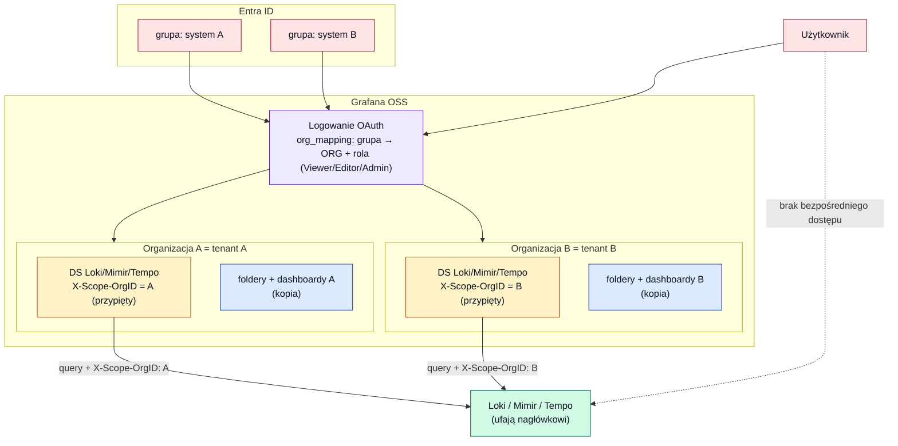
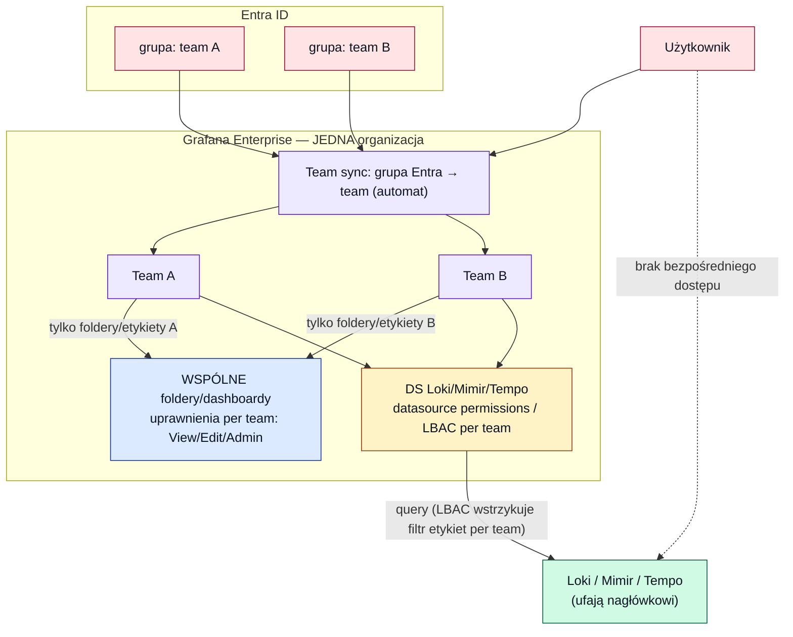

# 16 — RBAC w Grafanie: model OSS (organizacje) vs Enterprise

[◄ Dyskusja o wyborze narzędzi](15-dyskusja-ze-mna-na-temat-wyboru-narzedzi.md) · [README ►](README.md)

> Jak wygląda RBAC, gdy użytkownicy mają dostęp **wyłącznie do Grafany** (nie do backendów), a
> izolacja tenantów idzie przez `X-Scope-OrgID`. Rozpisane graficznie dla **Grafany OSS** i
> **Enterprise**, z tym, **co dokładnie daje Enterprise** i **ograniczeniami każdego podejścia**.
> Kontekst: [dok. 11](11-granulacja-uprawnien-warianty.md), [dok. 13](13-loki-wplyw-na-self-hosted-i-izolacje.md), [dok. 15](15-dyskusja-ze-mna-na-temat-wyboru-narzedzi.md).

---

## 0. Fundament wspólny dla obu (model zaufania)

- Użytkownik loguje się **tylko do Grafany** (Entra OAuth). **Nie ma konta** w Loki/Mimir/Tempo.
- Grafana odpytuje backend **poświadczeniem data source'a** (nie tożsamością usera) i **przypina
  `X-Scope-OrgID`** = tenant. Backend **ufa nagłówkowi**.
- ⚠️ **Krytyczne ograniczenie obu podejść:** skoro backend ufa nagłówkowi, **musi być
  nieosiągalny sieciowo dla użytkowników** — tylko Grafana i kolektory mają do niego dostęp.
  Bezpośredni dostęp do API Loki/Mimir = możliwość podania dowolnego `X-Scope-OrgID` i odczytu
  cudzego tenanta. Izolacja stoi na (a) przypięciu nagłówka w Grafanie **i** (b) izolacji sieci.

---

## 1. Grafana OSS — wszystko oparte o ORGANIZACJE

Jedna organizacja Grafany = jeden tenant/system. Data source'y (Loki/Mimir/Tempo z **przypiętym**
`X-Scope-OrgID`) żyją w danej org. Członkostwo w org i rola nadawane z grup Entra przez
**`org_mapping`** w `[auth.azuread]` (OSS od Grafany 11.2).

**Jak działa izolacja:** user zmapowany tylko do org A widzi wyłącznie data source'y i dashboardy
org A → nie dosięgnie tenanta B. Granica = **brzeg organizacji**.

### Ograniczenia OSS (multi-org)

- **Rola w org jest zgrubna** — tylko Viewer/Editor/Admin dla **całej** org. Brak natywnej
  granulacji „team A edytuje folder X, team B ogląda folder Y" wewnątrz org.
  - *(Chcąc granulacji wewnątrz org: teamy + uprawnienia folderów OSS to potrafią, ale
    **synchronizacja członkostwa teamów z Entra = team sync = Enterprise** — w OSS trzeba
    **reconcilera** ([dok. 12](12-reconciler-architektura-mechanizmy.md)) albo ręcznie.)*
- **Duplikacja treści** — dashboardy, data source'y i reguły alertów **powielasz w każdej org**.
  Wspólny dashboard dla 20 systemów = 20 kopii (provisioning przez API/Terraform/reconciler).
- **Brak widoku cross-org** — user obsługujący 2 systemy **przełącza kontekst organizacji**; nie
  ma jednego pulpitu ponad tenantami.
- **Brak uprawnień do data source per team** — w OSS każdy członek org odpytuje każdy DS w tej
  org (dlatego izolacja MUSI być na brzegu org, nie wewnątrz).
- **Koszt operacyjny rośnie z liczbą tenantów** — N organizacji + ich DS + treść do utrzymania.
- **Brak custom/fixed roles** — tylko basic roles.

---

## 2. Grafana Enterprise — JEDNA organizacja + teamy

Enterprise pozwala **zwinąć multi-org do jednej organizacji**: grupy Entra mapują się na **teamy**
(przez **team sync**, automatycznie), a izolacja idzie przez **uprawnienia folderów per team** oraz
**datasource permissions / LBAC** — w obrębie jednej org.

### Co konkretnie daje Enterprise (i po co)

1. **Team sync** — automatyczne mapowanie grupa Entra → członkostwo teamu. **Znika potrzeba
   reconcilera.**
2. **Datasource permissions** — ograniczenie „który team odpytuje który data source" **wewnątrz
   jednej org**. To pozwala trzymać wszystkie tenanty w **jednej** org bez multi-org.
3. **LBAC (dla Loki/Mimir)** — **jeden** data source, reguły **etykietowe per team** filtrują
   dane. Nie trzeba N data source'ów per tenant; izolacja idzie po etykietach (np. `namespace`).
4. **Foldery per team z granulacją** View/Edit/Admin — wewnątrz jednej org, na **współdzielonej**
   strukturze.
5. **Custom/fixed roles (fine-grained RBAC)** — własne role akcja+scope.

**Sedno:** Enterprise kupuje **granulację BEZ podatku od mnożenia organizacji** — jedna org,
wspólne dashboardy/DS, izolacja per team (folder + datasource + etykieta), automatyczny sync grup,
własne role.

### Czy `X-Scope-OrgID` znika przy Enterprise? Nie.

`X-Scope-OrgID` to **tenancy backendu** (Loki/Mimir/Tempo) — istnieje niezależnie od edycji
Grafany. Dopóki backend ma włączoną wielotenantowość, **każde żądanie (z Grafany i kolektorów)
musi go nieść**. Enterprise zmienia nie *czy* go używasz, lecz **jak dużo pracy on wykonuje**:

- **Wariant per-tenant DS + datasource permissions** — zostajesz przy **nagłówku per tenant**
  (N data source'ów, każdy z własnym `X-Scope-OrgID`), a Enterprise dokłada „który team może
  używać którego DS". Rola nagłówka bez zmian — zyskujesz tylko trzymanie tego w **jednej org**.
- **Wariant LBAC (wspólny DS)** — teamy dzielą **jeden** data source, a podział idzie **po
  etykietach** (`namespace`/`cluster`) regułami per team. Wtedy `X-Scope-OrgID` może być
  **gruby** (np. jeden tenant na cluster/org), a drobny podział systemów przenosi się na etykiety.

**Warstwy się uzupełniają, nie zastępują:** `X-Scope-OrgID` = strażnik **na poziomie
przechowywania** (+ izolacja sieci, §0); LBAC = drobny podział **po stronie Grafany**. Zaleca się
trzymać tenancy backendu włączoną nawet z LBAC (defense-in-depth) — inaczej ktokolwiek z
bezpośrednim dostępem do backendu widzi wszystko.

⚠️ **Pułapka LBAC (fail-open):** jeśli dla teamu **nie ma reguły** LBAC, ten user może odpytać
**wszystkie** logi/metryki. Macierz reguł LBAC staje się tak krytyczna jak uprawnienia folderów.

### Ograniczenia Enterprise

- **Koszt** (licencja „contact sales" / per aktywny user — [dok. 10](10-grafana-licencje-koszty-oss-reconciler.md)).
- **LBAC ma limit reguł** (~500–600 na data source) — przy bardzo wielu tenantach/etykietach do
  policzenia.
- **Ten sam model zaufania** — LBAC/datasource-permissions to egzekucja **po stronie Grafany**;
  backend nadal ufa nagłówkowi, więc **izolacja sieci backendów wciąż konieczna** (§0).
- **Konfiguracja LBAC** wymaga data source'a skonfigurowanego pod to (odpowiedni tryb auth) i
  utrzymania reguł etykietowych.
- Nie zmienia faktu, że **użytkownicy nie logują się do backendów** — to zaleta, ale i granica
  (żadnego RBAC „w Loki/Mimir per user" nie ma; wszystko dzieje się w Grafanie).

---

## 3. Model ze spotkania: cross-tenant query i „data source per strumień"

Na spotkaniu padły dwa powiązane mechanizmy „łączenia tenantów" ([transkrybcja](../transkrybcja) ~879–950). Mają **różne konsekwencje licencyjne**.

### 3.1. Cross-tenant query — jeden panel z kilku tenantów (license-free)

Loki/Mimir/Tempo pozwalają odpytać **wiele tenantów naraz**, podając `X-Scope-OrgID: tenantA|tenantB`
(pipe), przy włączonym `multi_tenant_queries_enabled`:

> „…możesz włączyć … multi-tenant queries i wtedy … X-Scope: taka lub taka organizacja" ([transkrybcja:879](../transkrybcja#L879)); „…wykres … z 2 data source'ów Loki" ([transkrybcja:908](../transkrybcja#L908)); „…po API Lokiego z 2 nagłówków" ([transkrybcja:948-950](../transkrybcja#L948-L950)).

To **feature backendu, nie licencji** — działa w OSS i Enterprise. „Scala" strumienie na jednym panelu.

### 3.2. „Data source per strumień + permissions per team" — to model ENTERPRISE

Rekomendowany na spotkaniu model („docelowy dla nas" — [transkrybcja:911](../transkrybcja#L911)):
**tenant Loki ≠ organizacja Grafany**. Jeden tenant = jeden strumień danych; ten sam data source
(przypięty do swojego `X-Scope-OrgID`) **dodajesz wiele razy** i nadajesz **uprawnienia per zespół**;
zespół widzi tyle data source'ów, ile strumieni ma oglądać (analogia do LogScale/CrowdStrike:
repozytoria + widoki):

> „…można … nie robić organizacji, tylko **dodać ten data source wiele razy** … na widokach ustawia się uprawnienia" ([transkrybcja:884-885](../transkrybcja#L884-L885)); „…**permissions dla odpowiedniego zespołu**" ([transkrybcja:933](../transkrybcja#L933)); „…**macie kontrolę, co kto widzi, co kto może kwerować**" ([transkrybcja:901](../transkrybcja#L901)).

⚠️ **To jest model Enterprise.** „Uprawnienia do data source per zespół" = **datasource permissions
= Enterprise/Cloud** (spotkanie dotyczyło Azure Managed Grafany, która jest oparta o Enterprise).
**W czystym OSS** tego nie zrobisz — każdy w org widzi każdy DS — więc izolacja spada z powrotem na
**multi-org** (§1). Czyli ten „docelowy model" to dokładnie kolumna **Enterprise** z §2, nie OSS.

### 3.3. Użytkownik nie nadpisze nagłówka (przez Grafanę)

> „…nawet jakby strzelił po API do tego data source'a, **backend Grafany nadpisze na właściwy**" ([transkrybcja:918](../transkrybcja#L918)); „…zapytanie zostanie skonstruowane przez backend Grafany" ([transkrybcja:950](../transkrybcja#L950)).

Przez Grafanę user **nie wstrzyknie** własnego `X-Scope-OrgID` — nagłówek jest przypięty do data
source'a. Ale **bezpośredni dostęp do API backendu** to obchodzi → wraca warunek **izolacji sieci** z §0.

---

## 4. Porównanie

| Aspekt | OSS (multi-org) | Enterprise (jedna org + teamy) |
|---|---|---|
| Jednostka izolacji | **organizacja** (1 org = 1 tenant) | **team** w jednej org |
| Mapowanie z Entra | `org_mapping` → org + rola (OSS 11.2) | **team sync** (automat) |
| Granulacja wewnątrz tenanta | zgrubna (Viewer/Editor/Admin na org)\* | **foldery per team** View/Edit/Admin |
| Izolacja data source | brzeg org (wszystko w org wspólne) | **datasource permissions / LBAC** per team |
| Współdzielenie dashboardów | ❌ duplikacja per org | ✅ wspólne w jednej org |
| Jeden pulpit dla usera (wiele systemów) | ❌ przełączanie kontekstu org | ✅ jeden pulpit (wg uprawnień) |
| Cross-tenant query `A\|B` (dane z wielu tenantów w 1 panelu) | ✅ feature backendu (license-free) | ✅ feature backendu (license-free) |
| Custom roles | ❌ tylko basic | ✅ |
| Koszt licencji | brak (OSS) | płatny |
| Koszt operacyjny | rośnie z liczbą org (+reconciler dla granulacji) | niższy przy wielu tenantach |

\* Granulację wewnątrz org w OSS da się osiągnąć teamami + uprawnieniami folderów, ale **członkostwo
teamów trzeba synchronizować reconcilerem** (team sync jest Enterprise) — [dok. 12](12-reconciler-architektura-mechanizmy.md).

---

## 5. Wniosek

- **OSS** = izolacja **brzegiem organizacji**. Prosta koncepcyjnie, darmowa, ale płacisz
  **duplikacją treści, brakiem cross-org i zgrubną rolą** (lub reconcilerem dla granulacji).
  Dobra przy **niewielu tenantach** albo gdy izolacja per-tenant wystarcza na poziomie org.
- **Enterprise** = izolacja **per team w jednej org** (datasource permissions/LBAC + team sync +
  custom roles). Kupujesz **granulację i współdzielenie bez mnożenia org** — opłaca się przy
  **wielu tenantach/systemach** i wymogu wspólnych dashboardów + drobnego dostępu.
- **Oba** dzielą ten sam warunek bezpieczeństwa: **backendy muszą być nieosiągalne bezpośrednio**
  (ufają `X-Scope-OrgID`).

Decyzja OSS vs Enterprise = funkcja **liczby tenantów, potrzeby współdzielenia i budżetu** — patrz
progi w [dok. 10](10-grafana-licencje-koszty-oss-reconciler.md) i pytania w
[pytania_do_zespołu.md](../pytania_do_zespołu.md).
