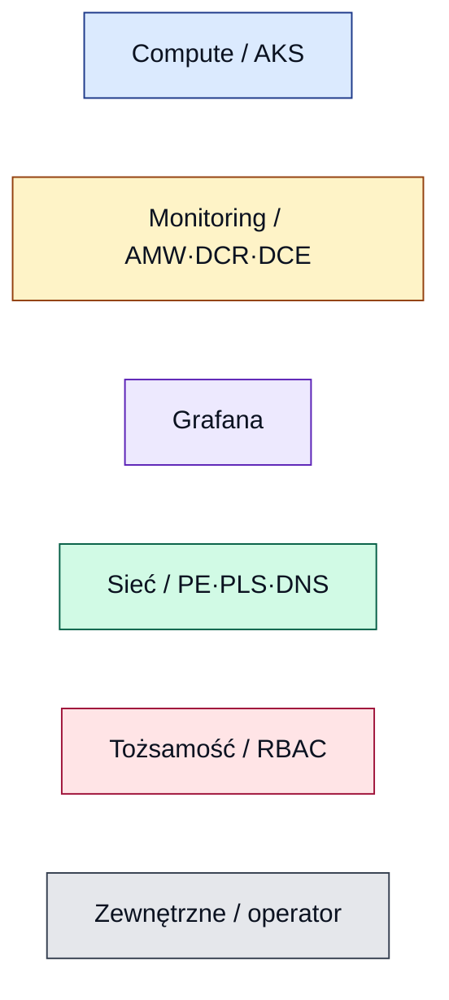

# Azure Managed Grafana + Prometheus — dokumentacja PoC

Dokumentacja techniczna laboratorium z katalogu
[`../grafana-poc-example/terraform`](../grafana-poc-example/terraform). PoC pokazuje,
jak **Azure Managed Grafana** odpytuje metryki Prometheusa zbierane dwiema niezależnymi
ścieżkami do **Azure Monitor Workspace (AMW)**, z naciskiem na **prywatną łączność**
(Private Endpoint / Private Link Service) oraz uwierzytelnianie tożsamościami zarządzanymi.

## Streszczenie architektury

Kręgosłupem jest **Azure Monitor Workspace** — to on pełni rolę backendu Prometheusa,
a Grafana łączy się z nim jako źródło danych typu `prometheus` (auth przez Managed
Identity). Postawiono **dwa niezależne AMW**, aby pokazać dwie drogi zbierania metryk:
**AMW‑A** karmiona dodatkiem *managed Prometheus* w AKS (`ama-metrics` → DCR‑A) i
prywatyzowana przez Private Endpoint, oraz **AMW‑B** karmiona *self‑hosted* Prometheusem
(Helm, `remote_write` → DCR‑B) i pozostająca publiczna. Grafana nigdy nie łączy się z
Prometheusem „wprost" — zawsze przez query endpoint AMW, a self‑hosted Prometheus jest
dodatkowo osiągalny prywatnie przez Managed Private Endpoint → Private Link Service.

## Spis dokumentów

| Dokument | Zawartość |
|---|---|
| [01 — Architektura](01-architecture.md) | Przegląd całości, diagram architektury, inwentarz zasobów |
| [02 — Przepływ metryk](02-metrics-flow.md) | Ingest i query dla AMW‑A i AMW‑B (osobne diagramy) |
| [03 — Sieć i DNS](03-networking-dns.md) | VNety, Private Endpoint, PLS, Private DNS, demo NXDOMAIN |
| [04 — RBAC i tożsamości](04-rbac-identity.md) | Macierz ról, model uwierzytelniania na każdym styku |
| [05 — Runbook wdrożenia](05-deployment-runbook.md) | Kolejność kroków, diagram sekwencji, komendy |
| [06 — Scenariusze demo](06-scenarios.md) | Scenariusze S1.x / S2.x i oczekiwane wyniki |
| [07 — Decyzje projektowe](07-design-decisions.md) | Świadome decyzje i pułapki (z odniesieniami do kodu) |
| [08 — Self-hosted Grafana na AKS](08-self-hosted-grafana-analysis.md) | Analiza: jak dodać self-hosted Grafanę (Helm), metoda, źródła danych, dashboardy, plan |
| [09 — Model dostępu (grupy Entra)](09-selfhosted-rbac-entra-model.md) | RBAC/logowanie: mapowanie grup Entra → role/foldery/dashboardy; przeniesienie modelu z `managed_grafana_internal`; blokery app-reg i Enterprise |
| [10 — Licencje i koszty + OSS reconciler](10-grafana-licencje-koszty-oss-reconciler.md) | Enterprise/Cloud vs OSS: cenniki (fakty ze źródłem + „contact sales"), progi opłacalności wg skali, warianty zamknięcia luki team sync (reconciler, `org_mapping` multi-org, Terraform), przegląd gotowych narzędzi, rekomendacja warunkowa |
| [11 — Granulacja uprawnień w wariantach](11-granulacja-uprawnien-warianty.md) | Porównanie granulacji uprawnień (foldery/dashboardy/datasource) w wariantach A–D; diagramy (mapa granulacji, poziomy egzekwowania); kluczowa oś: izolacja query datasource = tylko Enterprise/Cloud lub multi-org |
| [12 — Reconciler: architektura i mechanizmy](12-reconciler-architektura-mechanizmy.md) | Jak działa reconciler (wariant B): pętla reconcile, funkcjonalności i mechanizmy Grafany (HTTP API, team sync przez API, foldery/uprawnienia) i Azure (Graph API, app registration, Workload Identity); auth, group overage, granice |
| [13 — Loki: wpływ na self-hosted i izolację](13-loki-wplyw-na-self-hosted-i-izolacje.md) | Jak Loki zmienia analizę OSS vs Enterprise: izolacja logów = tylko datasource permissions/LBAC (Enterprise) lub multi-org; reconciler nie pomaga; co Loki potrafi zintegrować (Alloy/OTLP/Fluent) a czego nie (nie full-text, nie metryki/ślady) |
| [14 — Alternatywy dla Grafany (RBAC)](14-alternatywy-dla-grafany-rbac.md) | Narzędzia z granularniejszym RBAC w OSS: Perses (CNCF), OpenSearch Dashboards, Superset, Zabbix; kiedy architektura (instancje per tenant/multi-org) bije zmianę narzędzia; bilans migracji |
| [15 — Dyskusja o wyborze narzędzi](15-dyskusja-ze-mna-na-temat-wyboru-narzedzi.md) | Zapis rozmowy: uzasadnienie docelowego stacku (Prometheus→Mimir, Vector→Loki, OTel→Tempo, wspólny X-Scope-OrgID) + Q&A ze wszystkimi pytaniami i odpowiedziami |
| [16 — RBAC: OSS (organizacje) vs Enterprise](16-rbac-grafana-oss-vs-enterprise-organizacje.md) | Graficznie: model dostępu gdy user ma wjazd tylko do Grafany; OSS = izolacja brzegiem organizacji (org_mapping), Enterprise = jedna org + team sync + datasource permissions/LBAC + custom roles; ograniczenia każdego |

> Prompt, z którego powstała ta dokumentacja: [ANALYSIS_PROMPT.md](ANALYSIS_PROMPT.md).

## Konwencja diagramów

Wszystkie diagramy używają Mermaid. Kolory kodują warstwę zasobu:

Linia **ciągła** = ścieżka publiczna / w obrębie sieci; linia **przerywana** = ścieżka
prywatna (Private Endpoint / Private Link). Etykiety krawędzi podają protokół i sposób
uwierzytelniania.

## Zweryfikuj po wdrożeniu (checklista)

- [ ] **AMW‑A ingest** — metryka `up` widoczna w AMW‑A (dodatek `ama-metrics` działa, DCR‑A powiązany). Patrz nota w [rbac.tf:50‑51](../grafana-poc-example/terraform/rbac.tf#L50-L51).
- [ ] **AMW‑B ingest** — self‑hosted Prometheus loguje udane `remote_write` do AMW‑B (poprawny URL, auth `azuread` kubeleta).
- [ ] **Data sources w Grafanie** — `AMW-A`, `AMW-B`, `AzMon-CurrentUser`, `OSS-Prometheus-PLS` istnieją i „Test" przechodzi ([configure-grafana.sh](../grafana-poc-example/terraform/configure-grafana.sh)).
- [ ] **DNS prywatny (AMW‑A)** — z poda w AKS `dig` FQDN AMW‑A zwraca adres z `10.10.1.0/24` (rekord w Private DNS zone).
- [ ] **DNS AMW‑B bez PE** — analogiczny `dig` dla AMW‑B daje NXDOMAIN dopóki nie postawisz ręcznego PE (demo S1.3).
- [ ] **MPE → PLS** — połączenie `mpe-oss-prometheus` do `pls-prometheus` w stanie *Approved*, źródło `OSS-Prometheus-PLS` odpowiada.
- [ ] **RBAC** — tożsamość Grafany ma `Monitoring Data Reader` na obu AMW; kubelet ma `Monitoring Metrics Publisher` na DCR‑A/B.

> **Sprzątanie:** przed `terraform destroy` uruchom [teardown.sh](../grafana-poc-example/terraform/teardown.sh) `<rg> <grafana>`, jeśli wykonywano jakikolwiek krok S1.x z CLI.
