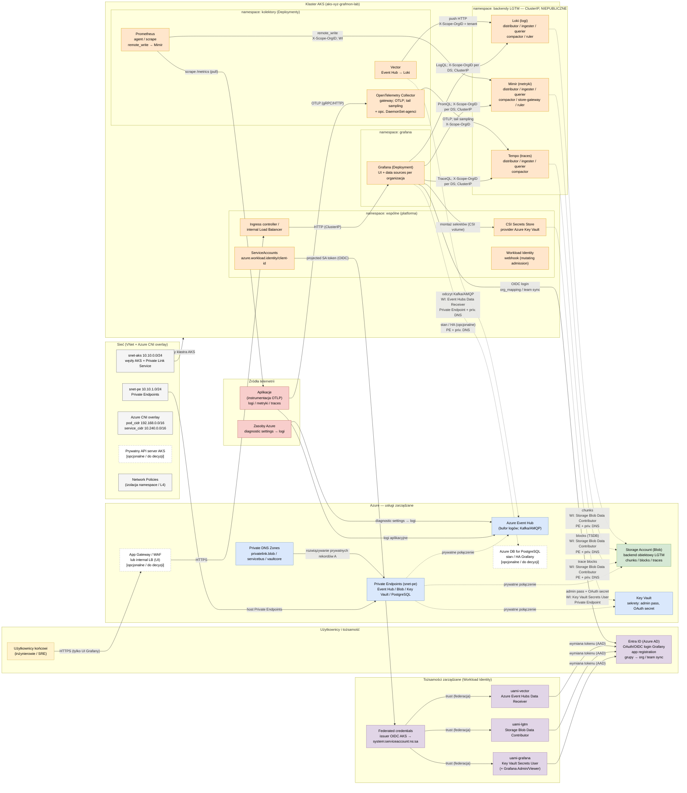
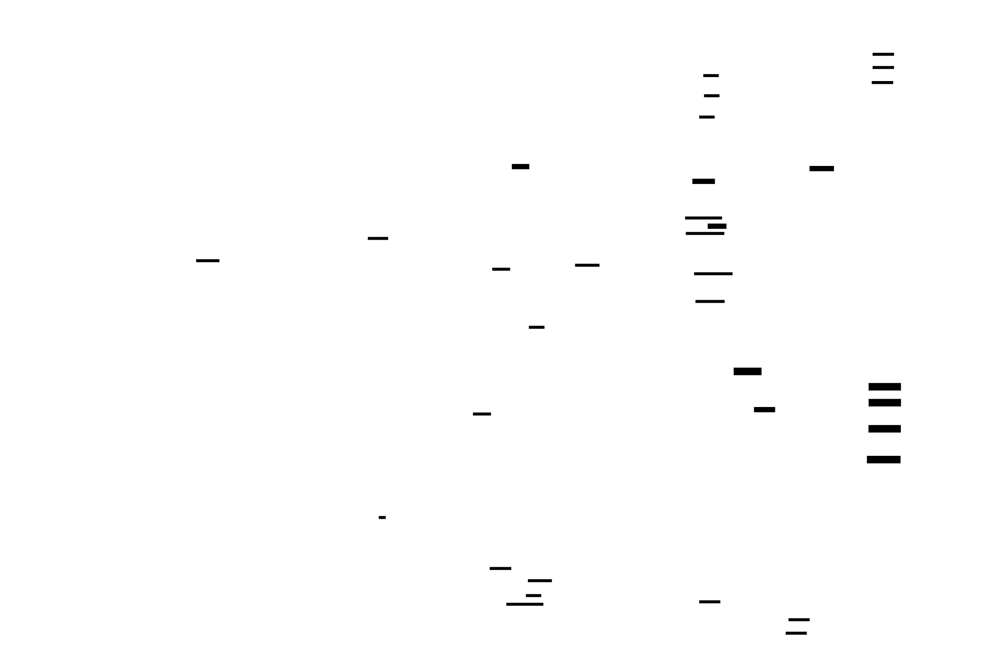

# Architektura DOCELOWA — self-hosted LGTM na AKS (render inline)

> Ten sam diagram w trzech reprezentacjach o **identycznej treści logicznej**:
> **Mermaid** (renderuje się inline w IDE/GitHub — główny podgląd),
> **D2 (Terrastruct)** (pełne źródło + osadzony SVG) oraz **Excalidraw**
> (`architektura-target.excalidraw`, import na excalidraw.com).
>
> Model bezpieczeństwa odwzorowany 1:1 z Terraform PoC
> (`../../grafana-poc-example/terraform`), a NIE zgadywany — patrz nagłówek pliku `.d2`
> i sekcja „Wierność względem Terraform" niżej.

---

## 1. Render inline (Mermaid) — architektura docelowa



### Legenda

| Kolor | Warstwa |
|-------|---------|
| żółty `#FFF2CC` | Użytkownicy |
| fioletowy `#E1D5E7` | Tożsamość (Entra / UAMI) |
| niebieski `#DAE8FC` | Azure — usługi zarządzane |
| zielony `#D5E8D4` | Backend obiektowy (Blob) |
| szary `#F5F5F5` | Sieć / VNet / CNI |
| pomarańczowy `#FFE6CC` | Workload na AKS |
| czerwony `#F8CECC` | Źródła telemetrii |
| biały, obrys przerywany | Opcjonalne / do decyzji |

**Styl linii:** linia **ciągła** = łączność w klastrze / publiczna; linia
**przerywana** = ścieżka **PRYWATNA** (Private Endpoint / PLS).

---

## 2. Adnotacje bezpieczeństwa (obowiązkowe na diagramie)

- **GRANICA ZAUFANIA TENANTÓW.** Loki / Mimir / Tempo **ufają nagłówkowi
  `X-Scope-OrgID`** (to on wyznacza tenanta). Dlatego działają jako **ClusterIP,
  niepubliczne** — brak bezpośredniego dostępu użytkowników. Dostęp mają **tylko**:
  kolektory (Vector / OTel / Prometheus — **zapis**) i Grafana (**odczyt**). Namespace
  `backendy LGTM` jest na diagramie wyróżniony grubszym, czerwonym obrysem.
- **PRYWATNA ŁĄCZNOŚĆ DO AZURE.** Event Hub, Blob, Key Vault, (opc.) PostgreSQL —
  dostępne **wyłącznie** przez **Private Endpoints + prywatne strefy DNS**
  (wzorzec przeniesiony z `dns.tf`: jawna strefa `privatelink.*` + PE w `snet-pe`).
- **ZERO SEKRETÓW W KODZIE.** Tożsamość: **AKS Workload Identity** (UAMI + federated
  credential, issuer OIDC AKS → `system:serviceaccount:...`). Sekrety: **Key Vault**
  montowany przez **CSI Secrets Store**.
- **RBAC least-privilege** (role wypisane na krawędziach): *Azure Event Hubs Data
  Receiver* (Vector), *Storage Blob Data Contributor* (Loki/Mimir/Tempo),
  *Key Vault Secrets User* (Grafana), oraz role Grafany *Admin/Viewer* + `org_mapping`.
- **SIEĆ:** Azure CNI **overlay** (pod_cidr oddzielny od VNet), BYO subnet
  (`snet-aks`), (opc.) prywatny API server; UI za Ingress / WAF / internal LB;
  backendy prywatne (ClusterIP).

### Mapowanie PoC (managed) → docelowe (self-hosted)

| PoC (obecny Terraform, managed) | Docelowe (self-hosted na AKS) |
|---|---|
| Managed Grafana (`grafana.tf`) | **Grafana** (Deployment na AKS) |
| AMW + DCR + DCE, ama-metrics (`monitoring.tf`, `aks.tf`) | **Mimir** (+ **Prometheus** jako scraper) |
| `remote_write` do AMW-B (`prometheus-values.yaml`) | `remote_write` do **Mimir** |
| Auth kubelet / IMDS `azuread` (`prometheus-values.yaml`) | **Workload Identity** (UAMI + federated credential) |
| PE + prywatna strefa DNS do AMW (`dns.tf`) | **Private Endpointy + prywatne strefy DNS** do Event Hub / Blob / Key Vault |
| PLS `pls-prometheus` + Managed Private Endpoint (`prometheus-values.yaml`) | wzorzec **prywatnego wystawienia** UI Grafany / cross-VNet |
| Managed Prometheus zbiera tylko metryki | **Vector** (logi z Event Hub) + **OTel Collector** (traces) — pełne LGTM |

### Wierność względem Terraform (Krok 0 — z kodu, nie zgadywane)

- `network.tf`: VNet `vnet-lab` **10.10.0.0/16**, `snet-aks` **10.10.0.0/24**
  (`private_link_service_network_policies_enabled = false` pod PLS), `snet-pe`
  **10.10.1.0/24**.
- `aks.tf`: `network_plugin = "azure"`, `network_plugin_mode = "overlay"`,
  `pod_cidr = 192.168.0.0/16`, `service_cidr = 10.240.0.0/16`,
  `dns_service_ip = 10.240.0.10`; `identity { type = "SystemAssigned" }` + kubelet
  identity; `monitor_metrics {}` (ama-metrics).
- `dns.tf`: jawna `azurerm_private_dns_zone`
  `privatelink.<region>.prometheus.monitor.azure.com` zlinkowana do `vnet-lab`;
  `azurerm_private_endpoint` `pe-amw-a` w `snet-pe` z `private_dns_zone_group`.
- `monitoring.tf`: AMW-A/AMW-B, DCE/DCR, `prometheus_forwarder`, stream
  `Microsoft-PrometheusMetrics` — komponenty **zastępowane** przez Mimir/Loki/Tempo
  (przeniesiony wzorzec „prywatny endpoint + strefa DNS").
- `grafana.tf`: managed Grafana **Standard** (pod Managed Private Endpoints),
  `identity SystemAssigned`, `public_network_access_enabled = true`
  (**prywatyzujemy dane i źródła, nie sam interfejs** — stąd UI za Ingress/WAF/LB).
- `rbac.tf`: `Monitoring Data Reader` (Grafana → AMW), `Monitoring Reader` (RG),
  `Monitoring Metrics Publisher` (AKS cluster MI + kubelet MI → DCR),
  `Network Contributor` (`vnet-lab`, pod internal LB / PLS), `Grafana Admin` /
  `Grafana Viewer`. App-registration SP **USUNIĘTY** (brak uprawnień w środowisku).
- `identity.tf`: `data.azuread_client_config` (właściciel `Grafana Admin`);
  app registration + SP + secret **usunięte** (blocker — brak uprawnień do
  rejestracji aplikacji). To motywuje docelowe **Workload Identity** zamiast SP+secret.
- `k8s/prometheus-values.yaml`: `service.type = LoadBalancer` + adnotacje
  `azure-load-balancer-internal` i `azure-pls-*` (**internal LB + PLS
  `pls-prometheus`**); `remoteWrite[].azuread.managed_identity.client_id` =
  **client_id kubeleta z IMDS** (169.254.169.254) — docelowo zastąpione Workload Identity.

---

## 3. Render D2 (Terrastruct) — osadzony SVG

Diagram `.d2` **udało się zrenderować** w tym środowisku (`d2 0.7.1`, `d2 fmt`
czysty). Wynikowy plik: `architektura-target.svg`.



> Jeśli podgląd Markdown nie osadza SVG, otwórz `architektura-target.svg` bezpośrednio
> lub zrenderuj ponownie: `d2 architektura-target.d2 architektura-target.svg`.

### Pełne źródło D2 (do wglądu / porównania)

```d2
direction: right

classes: {
  users: { style.fill: "#FFF2CC"; style.stroke: "#D6B656"; style.stroke-width: 2 }
  identity: { style.fill: "#E1D5E7"; style.stroke: "#9673A6"; style.stroke-width: 2 }
  azure: { style.fill: "#DAE8FC"; style.stroke: "#6C8EBF"; style.stroke-width: 2 }
  storage: { style.fill: "#D5E8D4"; style.stroke: "#82B366"; style.stroke-width: 2 }
  network: { style.fill: "#F5F5F5"; style.stroke: "#666666"; style.stroke-width: 2 }
  workload: { style.fill: "#FFE6CC"; style.stroke: "#D79B00"; style.stroke-width: 2 }
  sources: { style.fill: "#F8CECC"; style.stroke: "#B85450"; style.stroke-width: 2 }
  optional: { style.fill: "#FFFFFF"; style.stroke: "#999999"; style.stroke-width: 2; style.stroke-dash: 4 }
}

# Pełne, kompletne źródło znajduje się w pliku architektura-target.d2 (obok tego .md).
# Zawiera wszystkie strefy (Użytkownicy/Tożsamość, Źródła, Azure, Sieć, AKS z namespace'ami,
# Tożsamości zarządzane), notatki bezpieczeństwa (granica X-Scope-OrgID, prywatna łączność,
# zero sekretów, mapowanie PoC→docelowe) oraz legendę. Poniżej skrót krawędzi kluczowych:

zrodla.azres -> azure.eventhub: "diagnostic settings → logi"
aks.kolektory.vector -> azure.eventhub: "WI: Event Hubs Data Receiver; PE + priv. DNS" { style.stroke-dash: 4 }
aks.kolektory.vector -> aks.lgtm.loki: "push HTTP; X-Scope-OrgID = tenant"
aks.kolektory.otel -> aks.lgtm.tempo: "OTLP; tail sampling; X-Scope-OrgID"
aks.kolektory.prom -> aks.lgtm.mimir: "remote_write; X-Scope-OrgID; WI"
aks.lgtm.loki -> azure.blob: "chunks; WI: Storage Blob Data Contributor; PE" { style.stroke-dash: 4 }
aks.graf.grafana -> aks.lgtm.mimir: "PromQL; X-Scope-OrgID per DS; ClusterIP"
aks.wspolne.csi -> azure.kv: "WI: Key Vault Secrets User; Private Endpoint" { style.stroke-dash: 4 }
uzytkownicy.user -> azure.appgw: "HTTPS (tylko UI Grafany)"
aks.wspolne.sa -> tozsamosci.fed: "projected SA token (OIDC)"
tozsamosci.uami_grafana -> uzytkownicy.entra: "wymiana tokenu (AAD)"
```

> Kompletne, renderowalne źródło to `architektura-target.d2` obok tego pliku (powyższy
> blok jest skrótem — w repo trzymamy pełną wersję jako osobny plik, by uniknąć rozjazdu treści).

---

## 4. Excalidraw — import

Plik `architektura-target.excalidraw` zawiera **tę samą** architekturę (te same
węzły, krawędzie, etykiety, strefy, legenda i paleta).

Import:

1. Otwórz <https://excalidraw.com>.
2. Menu (górny-lewy hamburger) → **Open** → wskaż `architektura-target.excalidraw`.
   Alternatywnie przeciągnij plik na kanwę.
3. W VS Code: rozszerzenie *Excalidraw* (`pomdtr.excalidraw-editor`) otwiera `.excalidraw`
   natywnie.

> Headless render `.excalidraw → PNG/SVG` **nie jest dostępny** w tym środowisku (brak
> `node` / `npx` / przeglądarki). JSON został zwalidowany jako poprawny (parsowanie +
> zgodność ze schematem `type: excalidraw, version: 2`).

---

## 5. Nota porównawcza — D2 vs Excalidraw (dla tego diagramu)

**D2 (Terrastruct)**

- **Plusy:** źródło tekstowe → wersjonowalne w gicie, czytelne diffy; auto-layout
  (dagre/ELK) sam rozmieszcza ~30 węzłów i ~30 krawędzi bez ręcznego dłubania;
  klasy = spójna paleta w jednym miejscu; zagnieżdżone kontenery świetnie oddają
  namespace'y AKS; `stroke-dash` czytelnie koduje ścieżki prywatne; renderuje się CLI
  do SVG (tu: sukces) — nadaje się do CI/„docs as code".
- **Minusy:** mniejsza kontrola nad dokładnym pikselem (layout „jaki wyjdzie");
  bogate etykiety wieloliniowe potrafią rozjechać rozmiary; brak natywnych ikon Azure
  bez dołączania zasobów; przy bardzo gęstych grafach krawędzie bywają poprowadzone
  nieoptymalnie.

**Excalidraw**

- **Plusy:** pełna, ręczna kontrola układu i estetyki (warsztatowy, „whiteboard" look);
  łatwe pokazywanie na spotkaniach i szybka edycja przez nietechnicznych; strzałki
  bound do kształtów utrzymują połączenia przy przesuwaniu.
- **Minusy:** źródło to duży JSON — słabo się diffuje i ręcznie edytuje; brak
  auto-layoutu (każdy węzeł i strzałka pozycjonowane ręcznie — pracochłonne przy tej
  liczbie elementów); trudniej utrzymać spójność przy zmianach; headless render wymaga
  Node/przeglądarki (tu niedostępne).

**Wniosek dla tej architektury:** przy ~30 węzłach, zagnieżdżonych namespace'ach i
gęstej sieci połączeń z etykietami **D2 wygrywa na utrzymywalności i szybkości**
(auto-layout + docs-as-code + render w CI). **Excalidraw** wygrywa, gdy diagram ma być
**ręcznie dopieszczony pod prezentację** lub wspólnie edytowany na tablicy. Treść
logiczna w obu jest identyczna — różni je tylko sposób renderowania.

---

## 6. Elementy oznaczone „opcjonalne / do decyzji"

- **Azure DB for PostgreSQL** — zewnętrzny stan / HA Grafany (vs SQLite w podzie).
- **Application Gateway / WAF vs internal Load Balancer** — sposób wystawienia UI.
- **Prywatny API server AKS** — pełna prywatyzacja płaszczyzny sterowania.
- **DaemonSet-agenci OTel** — obok gatewaya OTel Collector (zbieranie węzłowe).
